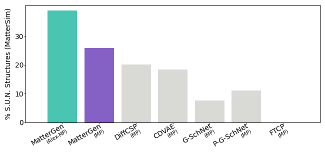
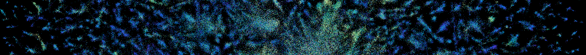
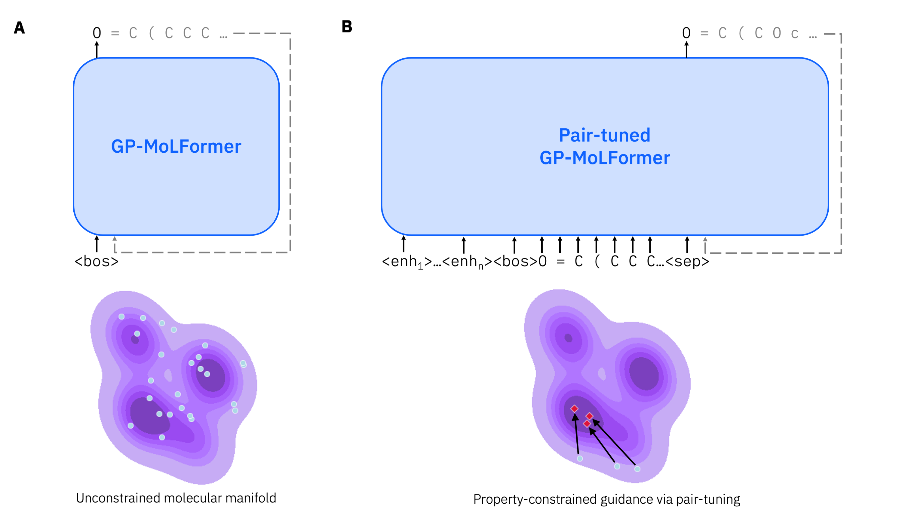

# AI4Science Studio

> **AMD's open recipe collection for AI across the sciences.**
> Runnable recipes for leading open models—on AMD Instinct accelerators or wherever you work.

## What is this?

AI4Science Studio connects **open AI models** with **clear, reproducible recipes** across science domains. Whether you want to run a state-of-the-art weather forecast, generate novel crystal structures, fold a protein, or train a molecular design agent, you'll find working scripts, container setups, and AMD/ROCm notes here.

Models are sourced from [Hugging Face](https://huggingface.co/) and leading research groups. Each recipe folder is self-contained: a model card, runnable examples, and optional AMD-specific tuning notes validated on real hardware.


## Science domains

<table>
<tr>
<td width="50%" valign="top">

### 🌍 Earth Science

[](earth_science/)

Weather forecasting, climate modeling, and Earth-system ML.
**ORBIT-2** is AMD's flagship model here—a scalable vision foundation model for global weather and climate downscaling, developed with ORNL and validated on AMD Instinct. Also: **StormCast**, **NeuralGCM** and more.

[Browse earth science recipes →](earth_science/)

</td>
<td width="50%" valign="top">

### 🔬 Material Science

[](material_science/)

Crystal structure generation, property prediction, and simulation surrogates.
Models: **MatterGen**, **HydraGNN** and more.

[Browse material science recipes →](material_science/)

</td>
</tr>
<tr>
<td width="50%" valign="top">

### 🧬 Protein Folding

[](protein_folding/)

Structure prediction, folding, and protein language models.

[Browse protein folding recipes →](protein_folding/)

</td>
<td width="50%" valign="top">

### 🏥 Healthcare

[](healthcare/)

Molecular design, medical imaging segmentation, and healthcare-adjacent ML.
Models: **REINVENT4**, **SemlaFlow**, **SwinUNETR**, **GP-MoLFormer** and more.

[Browse healthcare recipes →](healthcare/)

> ⚠️ Healthcare content is for **research and engineering only**—not medical advice or clinical use.

</td>
</tr>
</table>


## Use Claude Code or Cursor to add and run models

AI4Science Studio ships with **agent skills** for [Claude Code](https://claude.ai/code) and [Cursor](https://cursor.sh). You can talk to your AI coding assistant in plain language to get things done:

### Add a new model

```
/add-model microsoft/aurora → earth_science
```

The agent will scaffold the folder, populate the README with the HF model card details, and stub out recipe files—ready for you to fill in the scripts.

### Add a recipe to an existing model

```
/add-recipe StormCast ensemble inference on MI300X
```

Describe what you want, and the agent will generate a runnable script, Docker launch wrapper, and optional SLURM batch script following the repo's conventions.

### Audit a model folder

```
/check-model NeuralGCM
```

The agent reviews the folder for completeness: HF id, license, upstream links, recipe coverage, and AMD/ROCm notes. It returns a checklist and flags anything missing.

### Ask open-ended questions

You don't need a slash command. Just ask:

> *"How do I run StormCast ensemble inference on a single MI300X node?"*
> *"What models in this repo support fine-tuning?"*
> *"Show me the ROCm tuning notes for MatterGen."*

The agent reads the repo and answers from the actual recipe files.


## Quick start (without an agent)

1. **Browse** the domain folder for the model you want.
2. **Read** `models/<model>/README.md` for the HF model id, license, and upstream links.
3. **Run** the example scripts in `models/<model>/examples/` — each folder has a `docker_run.sh` that sets up the container automatically.

```bash
# Example: launch the StormCast container
cd earth_science/models/StormCast/examples
./docker_run.sh
```

No build step, no compiled code. The scripts pull public container images and model weights on first run.


## Contributing

1. Fork the repo and create a branch.
2. Copy [`earth_science/models/_template/`](earth_science/models/_template/) to your domain and model folder.
3. Fill in the model README and add at minimum one runnable recipe.
4. Open a pull request—or just use `/add-model` in Claude Code and let the agent do it.

See each domain's `models/README.md` for slug conventions and domain-specific notes.


## Disclaimers

- Each model is under its **upstream license**; check the model card on Hugging Face before use.
- **Healthcare** content is for research and engineering only. Do not commit patient-identifiable data or PHI.
- AMD/ROCm notes in individual recipes reflect what maintainers have tested—they do not replace upstream install matrices or official product documentation.
