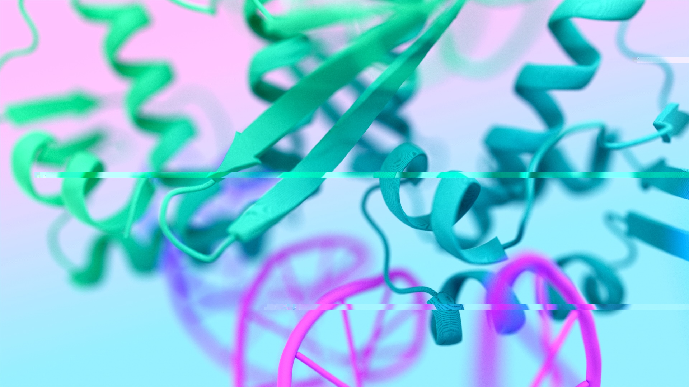

# AI4Science Studio

> **AMD's open recipe collection for AI across the sciences.**
> Runnable recipes for leading open models—on AMD Instinct accelerators or wherever you work.

## Talk to an agent — the fastest way to use this repo

AI4Science Studio is **agent-first**: the primary interface is an AI coding assistant ([Cursor](https://cursor.sh), [Claude Code](https://claude.ai/code), or similar). Every model has machine-readable metadata (`model.yaml`), structured recipe docs, and ready-to-run scripts that agents can discover, configure, and launch for you.

### Run any model

Just describe what you want:

> *"Run StormCast ensemble inference on MI300X with 4 members for 12 hours starting 2025-08-09T12"*

Or use a slash command (Claude Code):

```
/run-stormcast SC_SIF=/path/to/sif
/run-mattergen unconditional generation
/run-gpmolformer scaffold c1ccccc1
```

All 15 models have a `/run-*` command: `stormcast`, `orbit2`, `archesweather`, `aurora`, `gencast`, `neuralgcm`, `panguweather`, `mattergen`, `hydragnn`, `gpmolformer`, `swinunetr`, `semlaflow`, `reinvent4`, `matey`, `walrus`.

### Discover and compare models

```
/list-models                          # show all models
/list-models earth_science            # filter by domain
/list-models finetune                 # filter by task
/audit-models                         # readiness audit for all models
```

Or just ask:

> *"What models in this repo support fine-tuning?"*
> *"Which models are MIT licensed?"*
> *"Compare StormCast and ORBIT-2"*

### Add and audit models

```
/add-model microsoft/aurora → earth_science
/add-recipe StormCast ensemble inference on MI300X
/check-model NeuralGCM
```

### Machine-readable metadata

Agents read these files to understand the repo:

| File | Purpose |
|------|---------|
| [`models.yaml`](models.yaml) | Index of all 15 models across 5 domains |
| `<model>/model.yaml` | Per-model manifest: HF id, license, recipes, env vars, hardware |
| `.cursor/skills/` | Agent skills for Cursor (run models, discover, domain conventions) |
| `.cursor/rules/` | Contextual rules that fire when editing specific file types |
| `.claude/commands/` | Slash commands for Claude Code |

---

## What is this?

AI4Science Studio connects **open AI models** with **clear, reproducible recipes** across science domains. Whether you want to run a state-of-the-art weather forecast, generate novel crystal structures, fold a protein, or train a molecular design agent, you'll find working scripts, container setups, and AMD/ROCm notes here.

Models are sourced from [Hugging Face](https://huggingface.co/) and leading research groups. Each recipe folder is self-contained: a model card, runnable examples, and optional AMD-specific tuning notes validated on real hardware.


## Science domains

<table>
<tr>
<td width="50%" valign="top">

### 🌍 Earth Science

[](earth_science/)

Weather forecasting, climate modeling, and Earth-system ML.
**[ORBIT-2](earth_science/models/ORBIT-2/)** — a scalable vision foundation model for global weather and climate downscaling, developed in collaboration with ORNL and validated on AMD Instinct. Also: **StormCast**, **NeuralGCM**, **ArchesWeather**, **PanguWeather**, **GenCast**, **Aurora**.

[Browse earth science recipes →](earth_science/)

</td>
<td width="50%" valign="top">

### 🔬 Material Science

[](material_science/)

Crystal structure generation, property prediction, and simulation surrogates.
**[HydraGNN](material_science/models/HydraGNN/)** — a multi-task graph neural network for materials property prediction, developed at ORNL. Also: **MatterGen**.

[Browse material science recipes →](material_science/)

</td>
</tr>
<tr>
<td width="50%" valign="top">

### 🧬 Protein Folding

[](protein_folding/)

Structure prediction, folding, and protein language models.

[Browse protein folding recipes →](protein_folding/)

</td>
<td width="50%" valign="top">

### 🏥 Healthcare & Life Sciences

[](healthcare/)

Molecular design, medical imaging segmentation, and healthcare-adjacent ML.
Models: **REINVENT4**, **SemlaFlow**, **SwinUNETR**, **GP-MoLFormer**.

[Browse healthcare & life sciences recipes →](healthcare/)

> Content is for **research and engineering only**—not medical advice or clinical use.

</td>
</tr>
<tr>
<td width="50%" valign="top">

### ⚛️ Physics Simulation

Surrogate models and neural operators for continuum dynamics, fluid mechanics, turbulence, and multiphysics systems.
**[MATEY](physics_simulation/models/MATEY/)** — ORNL multiscale adaptive transformer for spatiotemporal physical systems, validated on Frontier/MI250X. Also: **Walrus** — Polymathic AI 1.3B cross-domain continuum dynamics foundation model.

[Browse physics simulation recipes →](physics_simulation/)

</td>
<td width="50%" valign="top">
</td>
</tr>
</table>


## Quick start (without an agent)

1. **Browse** the domain folder for the model you want.
2. **Read** `models/<model>/README.md` for the HF model id, license, and upstream links.
3. **Run** the example scripts in `models/<model>/examples/` — each folder has a `docker_run.sh` that sets up the container automatically.

```bash
# Example: launch the StormCast container
cd earth_science/models/StormCast/examples
./docker_run.sh
```

No build step, no compiled code. The scripts pull public container images and model weights on first run.


## Contributing

1. Fork the repo and create a branch.
2. Copy [`_template/`](_template/) to your domain and model folder.
3. Fill in the model README, create a `model.yaml`, and add at minimum one runnable recipe.
4. Add the model to [`models.yaml`](models.yaml).
5. Open a pull request—or just use `/add-model` in Claude Code and let the agent do it.

See each domain's `models/README.md` for slug conventions and domain-specific notes.


## Disclaimers

- Each model is under its **upstream license**; check the model card on Hugging Face before use.
- **Healthcare & Life Sciences** content is for research and engineering only. Do not commit patient-identifiable data or PHI.
- AMD/ROCm notes in individual recipes reflect what maintainers have tested—they do not replace upstream install matrices or official product documentation.
