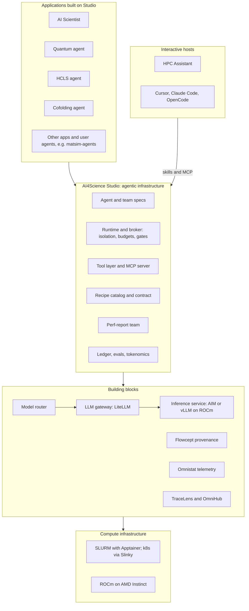
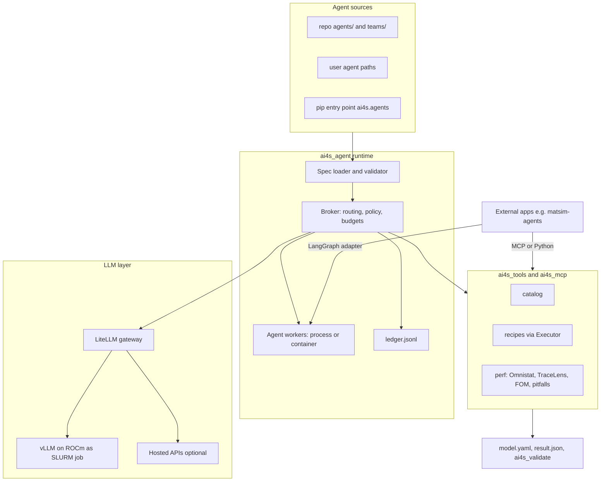

# Design spec: Agents for Science in AI4Science Studio

| Field | Value |
|---|---|
| Status | Draft v0.2, open for team review |
| Authors | _TBD_ |
| Reviewers | Workstream reviewers; see section 6.1 |
| Last updated | 2026-09-30 |
| Supersedes | Earlier planning notes (not in the repository) |
| Follow-up ADRs | 0001 thin harness, 0002 LLM gateway, 0003 SLURM to k8s, 0004 agent spec and messaging |

The document follows a conventional design-doc layout: context, goals, requirements, design, alternatives, rollout and open questions. Four parts are specific to agent systems: tool contracts (section 7.2), the isolation and threat model (section 9), the agent inventory (section 8.1) and the evaluation strategy (section 11).

Section 6.1 maps work already underway onto this substrate. Each workstream has a declared interface, a section, and open questions for its owner. Please comment on the row and section that match your work. Agreed changes go in section 16. Only efforts with a public repository are named; others are described by the capability they contribute, and the name and link are added when the repository is published.

---

## 1. Summary

AI4Science Studio is currently a catalog of AI-for-science recipes that coding agents such as Cursor and Claude Code read and execute. This spec proposes extending it into a portable **agent substrate for science on AMD HPC**, with six parts:

1. A **tool layer** (Python and MCP) that lets any agent discover models, submit recipes, and collect structured results and performance evidence.
2. A **declarative agent spec** (`agent.yaml`). Users define their own agents in it: logic, LLM backend, allowed tools, inputs and outputs, and peers.
3. An **A2A-aligned message protocol** with transports that work on SLURM today and on k8s later.
4. A **thin runtime with a broker** that enforces isolation, budgets and provenance.
5. An **on-prem LLM layer**: LiteLLM in front of vLLM on ROCm, with hosted APIs optional.
6. A first application: an **automatic post-job performance report** in which every finding cites telemetry, produced by a team of spec-defined agents.

Studio is a layer in a stack (section 6). Applications such as an AI Scientist, a quantum agent, a healthcare and life sciences agent, and a cofolding agent sit on top and create and connect agents on Studio. Studio sits on building blocks owned by other projects: a model router, an LLM gateway, an inference service such as AIM, Flowcept for provenance, and Omnistat for telemetry. External frameworks such as ORNL matsim-agents (LangGraph) can call Studio's tools, join a Studio team through an adapter, or be ported onto the runtime (section 10.1).

## 2. Context and problem

### 2.1 What exists

- **Contract layer:**
  - The root `models.yaml` index is generated from each model's `model.yaml`.
  - [`schemas/model.schema.json`](../../schemas/model.schema.json) defines the manifest.
  - Skills live under `.cursor/skills/`, and Claude commands under `.claude/commands/`.
  - [`tools/ai4s_validate`](../../tools/ai4s_validate/README.md) is importable and returns structured `Finding` objects. `make check` runs it.
- **Recipes:** 15 models across earth science, materials science, healthcare and physics simulation (the protein-folding domain is an empty placeholder). Scripts in each model's `examples/` directory are configured through environment variables. All 15 models have a Docker launcher and a preflight check. Ten also have SLURM plus Apptainer scripts; Aurora, GenCast, PanguWeather, REINVENT4 and SemlaFlow do not yet.
- **Perf analysis:** available for HydraGNN and ORBIT-2 only. It is driven by Markdown playbooks in `recipes/perf-analysis/agents/*.md`: a launcher, two analysts (Omnistat and TraceLens), two matching verifiers and a synthesizer. Each playbook declares its inputs and outputs and ends with a `STATUS` line. Evidence comes from Omnistat, TraceLens and figure-of-merit (FOM) extraction (`run_fom_extractor.py`).
- **Evals:** [`evals/`](../../evals/README.md) contains three contract cases and no runner.

### 2.2 What is missing

- **Host dependency.** Every agent workflow needs an interactive coding agent (Cursor or Claude Code) as its host. There is no headless runtime, LLM gateway or MCP server.
- **No programmatic recipe interface.** There is no API to submit a recipe, poll it and collect its result, and no recipe writes a standard result file. Outputs vary by model: Zarr stores, CIF archives, or metrics printed to logs.
- **No agent definition.** Playbooks are prose plus shell commands, duplicated per model, with no declared LLM, tools or peers.
- **No agent-to-agent messaging, isolation, budgets or provenance ledger.**

### 2.3 Why now

- **Recipe baseline.** Every recipe is being re-validated from a clean start on current ROCm (section 12), so the agent layer can build on known-good recipes.
- **Converging interfaces.** DOE Genesis/OPAL uses LiteLLM, MCP and A2A agent cards; Argonne Academy provides actor agents across federated HPC; ORNL matsim-agents drives HydraGNN through LangGraph. Aligning with these interfaces now lets Studio interoperate with all three.

## 3. Goals and non-goals

### 3.1 Goals

- **G1:** Any agent, Studio-native or external, can discover a model, submit its recipe to SLURM and receive a structured result without parsing logs.
- **G2:** Users can define their own agents: logic, LLM backend, tools and peers. They can keep these agents private, outside the repo.
- **G3:** Agents can exchange messages through a protocol that works on shared-filesystem SLURM clusters with no network assumptions, and that maps directly onto A2A.
- **G4:** The runtime, not the prompt, enforces what an agent may do: tools, peers, filesystem, budgets and secrets.
- **G5:** A HydraGNN or ORBIT-2 perf job automatically produces a report written by an on-prem LLM. Every claim in it cites telemetry or tool output.
- **G6:** Agent behavior is graded by deterministic evals: contract, perf and app checks.
- **G7:** Moving from SLURM to SLURM plus k8s means relocating components, not rewriting them.

### 3.2 Non-goals

- **A full agent framework.** No planner library, memory store or chat UI. Studio stays thin and adapts to LangGraph, Academy, OpenHands and OpenCode.
- **Automated performance optimization.** Changing configuration knobs, accepting or reverting runs, and tree search are out of scope for this effort.
- **Fault injection.** Hung-GPU and other injected faults are a separate study (section 13.4).
- **Self-healing of running jobs.** Recorded as future work (section 13.6).
- **Owning the building blocks.** Model routing, the LLM gateway, the inference service, Flowcept and Omnistat are owned by their own projects. Studio depends on their interfaces (section 6).
- **New scientific metrics.** Evals reuse the metrics recipes already compute.
- **Vendoring** upstream model code or matsim-agents.
- **Network isolation on shared SLURM** in v1. This is a known gap (section 9.2).

## 4. Related work

### 4.1 Science agent platforms

- **DOE Genesis / American Science Cloud** ([OPAL platform paper](https://arxiv.org/html/2609.08844v1)). The Model Access Gateway is built on LiteLLM. Agents interoperate over MCP and A2A and are described by agent cards. Provenance is recorded with Flowcept (PROV-AGENT). A co-scientist agent runs in k8s, and a compute agent runs on the SLURM login node.
  *Relevance:* matching LiteLLM, MCP and agent cards lets Studio components run inside Genesis unchanged. We adopt the same split between control-plane and compute-side agents.
- **Argonne [Academy](https://docs.academy-agents.org/stable/guides/hpc/)** (IPDPS'26). Stateful actor agents across federated HPC, placed with Parsl or Globus Compute.
  *Relevance:* Studio should offer an Academy adapter rather than build its own cross-site placement.
- **ORNL [matsim-agents](https://github.com/ORNL/matsim-agents).** Two LangGraph workflows (planner, executor, uncertainty gate and analyst; and a supervisor graph for composition exploration), an interactive discovery chat with a proposer/critic mode, and a pluggable LLM factory (Ollama, vLLM, OpenAI, Anthropic, Hugging Face). Relaxation uses HydraGNN, UMA or MACE. An active-learning loop labels structures with VASP or Quantum ESPRESSO. It includes launchers for Frontier, Aurora and Perlmutter, and a Codabench benchmark. Its own roadmap lists an MCP tool server and a distributed executor.
  *Relevance:* it overlaps Studio's HydraGNN recipe and is the first integration target (section 10.1). Studio's tool layer and Executor cover two items on its roadmap.
- **UK Isambard-AI "Agentic Ops."** Skills generated from site documentation, and a service-desk agent.
  *Relevance:* skills are becoming a portable unit across agent tools, so Studio should export its skills to the locations other tools read (`.agents/skills`, `.opencode/skills`).
- **[HPC Assistant](https://github.com/silogen/hpc-assistant).** An agent-agnostic assistant for AMD GPU login nodes. It ships site skills for SLURM, resource and quota commands, `rocprofv3`, and Omnistat energy profiling; a RAG knowledge base served over MCP; and a LiteLLM proxy that translates Anthropic requests to an OpenAI-compatible backend. Skills are markdown and work with Claude Code and OpenCode. Python dependencies run inside Singularity or Apptainer.
  *Relevance:* this is an interactive coding-agent host, not a headless runtime. Studio exports skills into its skill directories, runs the Studio MCP server beside its RAG MCP, and shares an alias convention with its LiteLLM proxy (section 10.2).
- **Cofolding drug-discovery agents.** A conductor LLM, reached through an OpenAI- or Anthropic-compatible API, coordinates molecular generation and structure evaluation. Typical tools are REINVENT over MCP, REST services for cofolding models such as Boltz-2 and OpenFold3, pose checks, interaction profiling, and property models, packaged as containers.
  *Relevance:* this overlaps Studio's REINVENT4 recipe and is the first candidate to populate the empty protein-folding domain. Integration follows the same three paths as matsim-agents (section 10.5). The repository is not linked here until it is public.

### 4.2 Performance agents

- **[PerfAdvisor](https://indico.global/event/16565/contributions/161717/):** analyzes rocprof-sys traces with a ReAct loop over local, read-only tools.
- **[IOAgent](https://arxiv.org/abs/2602.22017v1):** diagnoses Darshan I/O traces using retrieval and open-weight LLMs, evaluated on a labeled benchmark (TraceBench).
- **Omnistat 1.14:** ships agent skills (`open-database`, `job-report`, `job-analysis`) built on `omnistat-inspect`.

These systems share a pattern: preprocess traces into summaries, let the agent call analysis tools on demand, and evaluate against labeled cases. None of the systems reviewed combines cluster telemetry (Omnistat), kernel traces (TraceLens), OmniHub results, workload FOMs and independent verification of each claim. That combination is the gap Studio's perf report targets.

### 4.3 Industry systems

- **Edison Kosmos:** every claim can be traced to its code or literature source.
- **Sakana AI Scientist v2:** tree search guided by an experiment manager.
- **Lila and Periodic:** closed-loop autonomous labs.

From these we adopt auditability: every run keeps a ledger that links conclusions to evidence. Automated search is deferred.

### 4.4 Runtimes, models and infrastructure

- **OpenHands and OpenCode:** both run headless against vLLM through LiteLLM. AMD has published a guide to running OpenHands on Instinct GPUs.
- **Open-weight models for tool use:** gpt-oss-20b and gpt-oss-120b are served by vLLM with `--tool-call-parser openai`. On MI300X or MI355X, either fits on a single GPU; more GPUs are used only for throughput. NVIDIA Nemotron-Nano-9B-v2 and 12B-v2 (with their tool-call parser plugin) and Allen Institute OLMo are optional alternatives. Hosted models remain available through LiteLLM.
- **DSPy GEPA** (`optimize_anything`): optimizes prompts against a graded benchmark. It is a candidate for tuning the analyst and verifier prompts once perf bundles exist.
- **SchedMD [Slinky](https://slinky.schedmd.com/docs/):** the `slurm-operator` runs SLURM on k8s. In hybrid deployments, SLURM remains the job interface while the control plane moves to k8s.

### 4.5 Summary

| System | Relevant idea | What we adopt |
|---|---|---|
| DOE Genesis / OPAL (Model Access Gateway) | LiteLLM gateway; MCP plus A2A with agent cards; Flowcept PROV-AGENT provenance; control-plane agents in k8s, compute agents near SLURM | Match LiteLLM, MCP and agent cards exactly; optional Flowcept sink; the same control/compute split |
| Argonne Academy | Stateful actor agents; mailbox exchange; executors from threads to Globus Compute endpoints | An adapter for cross-site placement; mailbox-style messaging |
| ORNL matsim-agents | LangGraph planner, executor, UQ gate and analyst; pluggable LLM factory; HydraGNN, UMA or MACE relaxation; DFT active learning | First integration partner; LangGraph adapter, then a native port (M6); the same set of LLM providers |
| PerfAdvisor, IOAgent, Omnistat agent skills | Preprocess traces into summaries, give agents on-demand tools, grade against labeled benchmarks | Deterministic pitfall detectors, and an LLM that ranks and explains with required citations |
| OpenHands, OpenCode | Headless coding agents against vLLM through LiteLLM | Export skills to `.agents/skills` and `.opencode/skills`; adapters later |
| HPC Assistant | Login-node skills, RAG over MCP, LiteLLM proxy, Apptainer packaging | Interactive host; shared skill export and alias convention (section 10.2) |
| Cofolding drug-discovery agents | Conductor LLM plus MCP and REST tools for generation and cofolding | Same integration paths as matsim-agents; protein-folding recipes (section 10.5) |
| Edison Kosmos, Sakana AI Scientist v2 | Auditable claims; experiment manager | Run ledger; tree search explicitly deferred |
| SchedMD Slinky | SLURM operator in k8s (hybrid) | Path from SLURM to k8s |

## 5. Requirements

### 5.1 Functional

| ID | Requirement |
|---|---|
| F1 | `catalog.list_models` and `catalog.describe_model` return manifest data as typed objects |
| F2 | `recipes.submit(model, task, params)` returns a job handle; `recipes.status` and `recipes.result` return state and a schema-valid `result.json` |
| F3 | Agents are loaded from `agent.yaml` files found in the repo, in user paths, and in pip entry points |
| F4 | Teams are composed declaratively in `team.yaml`: pipeline, supervisor or debate, with human gates |
| F5 | Messages follow one envelope schema, with in-process and filesystem-mailbox transports |
| F6 | Agent logic can be a playbook, a Python class, or a LangGraph graph |
| F7 | Every tool call, message and LLM call is recorded in an append-only ledger |
| F8 | The perf-report team runs automatically as a dependent SLURM job after a perf run |
| F9 | External packages register tools through an `ai4s.tools` entry point, each declaring its environment and whether it runs in the broker or through the Executor (M6) |
| F10 | Team edges can be conditional on fields in the upstream result (M6) |
| F11 | Tools can charge named budget counters, such as `dft_calculations` or `node_hours`, which the broker caps (M6) |
| F12 | `result.json` accepts optional `validations`, `provenance` and namespaced app fields (M6) |
| F13 | A run can resume from its ledger and mailbox state after a failure or walltime limit (M6) |
| F14 | LLM aliases resolve through a routing policy, and agents may declare hints such as latency or quality tier (section 7.7) |
| F15 | The ledger records the tokenomics fields in section 7.11, and a run can emit a tokenomics summary |
| F16 | An external agent can replace a built-in agent when it accepts the same input schema and emits the same output schema |

### 5.2 Non-functional

| ID | Requirement |
|---|---|
| N1 | Isolation is enforced by the runtime: tool allowlist, peers, filesystem scope, budgets |
| N2 | No site-specific paths, partitions, node names or job IDs in committed files; site values live in gitignored cluster config |
| N3 | Works on the canonical ROCm image and Apptainer without root |
| N4 | Deterministic CI: `make check` runs agents with a fake LLM and needs no GPU |
| N5 | On-prem by default: works with an open-weight model on one GPU |
| N6 | Portable: SLURM now, k8s later, through an `Executor` interface and HTTP-capable transports |

## 6. Architecture overview

### Layered view

Studio is the agentic infrastructure layer. Science applications sit above it and create agents and teams on it. Studio in turn composes building blocks that other teams own: model routing, an LLM gateway, an inference service, provenance, and telemetry. Studio does not reimplement those blocks; it depends on their interfaces.



| Layer | Owns | Interface to the layer below |
|---|---|---|
| Applications | Domain logic, prompts, domain tools, human review of results | `agent.yaml`, `team.yaml`, `ai4s.agents` and `ai4s.tools` entry points, or MCP (section 10) |
| Interactive hosts | A person's session on a laptop or a login node | Exported skills and the MCP server (section 10.2) |
| Studio | Specs, broker policy, tool registry, recipe contract, perf-report team, ledger and evals | LLM aliases, Executor, telemetry and provenance exporters |
| Building blocks | Endpoint selection, model serving, provenance storage, telemetry collection | OpenAI-compatible HTTP, Prometheus and Omnistat queries, Flowcept API |
| Compute infrastructure | Scheduling, containers, GPUs | `sbatch` and `srun`, k8s objects, Apptainer and Docker |

[AIM](https://github.com/amd-enterprise-ai/aim-build) (AMD Inference Microservice) packages vLLM in containers with hardware-specific profiles and serves an OpenAI-compatible API, with a k8s deployment path through KServe. On SLURM clusters the same role is filled by a vLLM job (section 7.7). Studio only depends on the OpenAI-compatible endpoint, so either can sit behind the gateway.

### Component view



**Design rules:**

- The broker is the only component that holds tool, LLM and secret access. Workers hold none of these.
- Everything that crosses a component boundary is a schema-validated JSON document: manifest, result, message, or ledger entry.
- Endpoints (LLM, OmniHub, MCP) are discovered from cluster config, never hardcoded.
- State lives under `$AI4S_SHARED_DIR` in run directories. An object store comes later.

### 6.1 Workstreams and interfaces

Several efforts are already underway. Each one keeps its own implementation and joins through the interface in the table. The owner of that work reviews the row. The layer column matches the layered view above.

| Workstream | Layer | Contributes | Interface | Section | Status |
|---|---|---|---|---|---|
| AI Scientist, quantum and HCLS agents | Applications | Domain teams | Paths A, B and C | 10.4 | Proposed interface |
| Cofolding agent | Applications | Generation, cofolding and scoring | Paths A, B and C; protein-folding recipes | 10.5 | Proposed interface |
| matsim-agents | Applications | Materials workflows | Paths A, B and C | 10.1 | Specified |
| HPC Assistant | Interactive hosts | Login-node skills, RAG and an inference proxy | Skill export and MCP | 10.2 | Specified; needs owner review |
| Perf-report team | Studio | First built-in team | `team.yaml` | 8 | Specified |
| Tokenomics | Studio | Latency, accuracy, throughput and energy per run | Ledger fields and `tokenomics.json` | 7.11 | Proposed interface |
| Orchestration (SLURM and k8s) | Studio and infrastructure | Executors and deployment patterns | `Executor` | 7.9, 7.10 | Specified; needs owner review |
| Model routing | Building blocks | Choose an endpoint for an alias | `llm.aliases`, `llm.hints`, ledger | 7.7 | Proposed interface |
| LLM gateway and inference service | Building blocks | OpenAI-compatible serving on ROCm, including AIM | Endpoint file and aliases | 7.7 | Specified; needs owner review |
| Flowcept | Building blocks | Provenance storage | Ledger exporter to PROV-AGENT | 7.8 | Proposed interface |
| Omnistat and the Omnistat agent | Building blocks | Telemetry, analysis, and energy samples | `claims` schema; `ai4s.agents` or A2A | 8.3 | Proposed interface |

## 7. Detailed design

### 7.1 Contract layer extensions

Add these to `model.yaml` and its schema:

- **`validation`** records the recipe validation status (section 12). `status` is `synthetic_ok` or `gated`; `gate` is a short portable reason; `app_eval` is `pass`, `fail`, `skipped` or `none`.
- **`outputs`** goes on each recipe entry. It holds artifact globs and metric regexes, so the tool layer can build `result.json` without editing every script.
- **`perf`** holds the FOM definition, a log regex and the primary metric. It is filled in for HydraGNN and ORBIT-2 first.

```yaml
recipes:
  - task: inference
    slurm: examples/sbatch_inference_amd.sh
    outputs:
      artifacts:
        - {glob: "${MG_OUTPUT_DIR}/generated_crystals_cif.zip", kind: structures}
      metrics: []
validation: {status: synthetic_ok, app_eval: none}
```

`result.json` (`schemas/result.schema.json`):

```json
{
  "model": "MatterGen", "task": "inference", "status": "completed",
  "job_id": "<id>", "started_at": "...", "ended_at": "...",
  "artifacts": [{"path": ".../generated_crystals_cif.zip", "kind": "structures", "bytes": 2011}],
  "metrics": {}, "app_eval": {"status": "none"},
  "params": {"MG_BATCH_SIZE": "1"}
}
```

### 7.2 Tool layer (`tools/ai4s_tools`, `tools/ai4s_mcp`)

- **One registry of typed tools.** Each tool has a name, input and output JSON schemas, a side-effect class (`read`, `submit` or `cancel`) and a handler.
- **Two ways to use it.** Through the broker in-process (Studio agents), or through MCP: stdio for local use, streamable HTTP for shared use (external agents, Cursor, Claude).
- **Tool groups for v1:**

| Tool | Side effect | Notes |
|---|---|---|
| `catalog.list_models`, `catalog.describe_model` | read | Wraps `models.yaml` and `model.yaml` |
| `validate.run` | read | Wraps `ai4s_validate` |
| `recipes.submit` | submit | Guarded: own jobs only; partition and account from cluster config; parameters checked against the manifest's `env_vars` |
| `recipes.status`, `recipes.result`, `recipes.logs` | read | `result` builds `result.json` from the `outputs` block |
| `recipes.cancel` | cancel | Only jobs this run submitted |
| `perf.omnistat_inspect`, `perf.tracelens_summary`, `perf.fom`, `perf.pitfalls` | read | Read-only over perf-run directories and OmniHub processed data |

- **Executor interface.** Methods: `submit`, `status`, `cancel`, `logs`. The `slurm` implementation ships first; `local` and `k8s` come later.
- **Parameter validation requires manifest cleanup.** Today some manifests list the variable names used inside the container, while the SLURM scripts read prefixed names. For example, MatterGen's `model.yaml` lists `BATCH_SIZE`, but `sbatch_inference_amd.sh` reads `MG_BATCH_SIZE`. Before `recipes.submit` can validate parameters, `env_vars` must declare the variables of each entry point, or record the mapping between the two names.

### 7.3 Agent spec (`agent.yaml`)

```yaml
name: omnistat_analyst
version: 0.1.0
role: Analyze Omnistat telemetry for one perf run and emit claims
llm:
  model: ai4s/analyst            # LiteLLM alias, resolved from cluster config
  temperature: 0
logic:
  kind: playbook                 # playbook | python | langgraph
  playbook: playbook.md          # python/langgraph: entrypoint: pkg.module:Symbol
tools:
  allow: [perf.omnistat_inspect, perf.fom, catalog.describe_model]
inputs:  {schema: perf_run_ref}
outputs: {schema: claims}
peers: [omnistat_verifier]
isolation:
  level: process                 # process | container
  read: ["perf_run:${input.job}"]
budget: {max_turns: 30, max_tokens: 200000, wallclock_s: 1800}
secrets: [llm.analyst]
trusted: false
```

- **Logic kinds:**
  - `playbook`: an LLM tool-use loop over the Markdown playbook. The playbook keeps the existing Inputs, Outputs and STATUS contract.
  - `python`: a subclass of `ai4s_agent.Agent` that implements `handle(msg, ctx)`.
  - `langgraph`: an adapter that wraps a compiled graph. Messages map to graph state and back.
- **Where agents are discovered, in order:**
  1. repo `agents/`
  2. `$AI4S_AGENTS_PATH`
  3. `~/.config/ai4science-studio/agents/`
  4. the pip entry-point group `ai4s.agents`

  If two sources define the same name, the earlier source wins and the validator warns.
- **Validator checks:**
  - the file matches the schema
  - every allowed tool exists
  - every peer resolves
  - the playbook or entrypoint exists
  - the LLM alias resolves when a cluster config is present
  - isolation matches the rules in section 9

Python logic, shown as a sketch:

```python
from ai4s_agent import Agent, Message

class ScreeningAgent(Agent):
    def handle(self, msg: Message, ctx) -> Message:
        job = ctx.tools.call("recipes.submit", model="HydraGNN", task="inference", params={})
        result = ctx.tools.call("recipes.result", job=job)
        summary = ctx.llm.complete(f"Summarize: {result}")
        return msg.reply(parts=[{"kind": "text", "text": summary}])
```

`ctx` is a proxy object. Every call it makes goes to the broker.

### 7.4 Team spec (`team.yaml`)

```yaml
name: perf-report
entry: dispatcher
agents: [dispatcher, omnistat_analyst, tracelens_analyst, omnistat_verifier, tracelens_verifier, synthesizer]
edges:
  - {from: dispatcher, to: [omnistat_analyst, tracelens_analyst]}   # fan-out
  - {from: omnistat_analyst, to: omnistat_verifier}
  - {from: tracelens_analyst, to: tracelens_verifier}
  - {from: [omnistat_verifier, tracelens_verifier], to: synthesizer, join: all}
exit: synthesizer
gates: []                        # e.g. {before: recipes.submit, approver: human}
budget: {wallclock_s: 3600}
```

The validator checks that every agent can be reached from the entry and that a path leads from each agent to the exit. `join: all` waits for every upstream result. Cycles are allowed only when the edge carries `max_rounds`, as in debate or critique loops. Conditional edges (F10) are not needed for the perf-report team and are deferred to M6.

### 7.5 Message protocol and transports

The envelope (`schemas/message.schema.json`) is modeled on A2A messages and tasks. `task_state` uses a subset of the A2A task states, and `parts` use the A2A part kinds. ADR 0004 will define the field-by-field mapping to A2A (for example, `conversation_id` maps to A2A's `contextId`).

```json
{
  "id": "msg-uuid", "conversation_id": "run-uuid", "parent_id": "msg-uuid|null",
  "sender": "omnistat_analyst", "recipient": "omnistat_verifier",
  "kind": "task|result|event|error",
  "task_state": "submitted|working|input-required|completed|failed",
  "parts": [{"kind": "text", "text": "..."}, {"kind": "data", "data": {}}, {"kind": "file", "uri": "run://omnistat/claims.json"}],
  "created_at": "2026-09-30T00:00:00Z"
}
```

- Large payloads travel as `run://` file references into the run directory, never inline.
- **Transports.** All implement one `Transport` interface:

| Transport | When | Mechanism |
|---|---|---|
| `inproc` | Local, CI | In-memory queues inside the broker |
| `fs_mailbox` | SLURM (v1 default) | Atomic-rename JSON files under `$AI4S_SHARED_DIR/agents/runs/<run_id>/<agent>/{inbox,outbox}/`; the broker routes from outbox to inbox |
| `a2a_http` | k8s, Genesis (later) | A2A over HTTP; agent cards generated from `agent.yaml` |

- **Delivery.** At least once. Receivers deduplicate by `id`. The broker assigns a per-sender sequence number, which preserves ordering for each sender-recipient pair.

### 7.6 Runtime and broker (`tools/ai4s_agent`)

- **Command line:**
  - `python -m ai4s_agent run team <name> --input key=value`
  - `python -m ai4s_agent run agent <name> ...`
  - `--dry-run --fake-llm <replay.jsonl>` for deterministic runs.
- **One broker per team run.** It loads and validates the specs, starts one worker per agent at the declared isolation level, routes messages, and handles every tool, LLM and secret request. It also enforces budgets and gates and writes the ledger.
- **Workers** run agent logic. They see only their inbox, outbox, working directory and declared read paths, plus a broker socket or mailbox for requests.
- **Human gates** pause the run in `input-required` state and write a gate file. `ai4s_agent approve <run_id> <gate>` resumes it. This works over SSH with no UI.

### 7.7 LLM layer

- **LiteLLM gateway.** Agents name an alias, for example `ai4s/analyst`. The alias maps to a real endpoint in `.cluster-config.yaml` under `llm.aliases`.
- **Inference service.** Any OpenAI-compatible endpoint on ROCm. On k8s this can be an AIM deployment; on SLURM it is the vLLM job below, or an AIM container run under Apptainer if that is validated (open question 14).
- **On-prem serving** lives in `platform/llm-serving/`:
  - `sbatch_vllm_serve_amd.sh`
  - `litellm.config.yaml`
  - an endpoint file on shared storage
- **Default models, to be validated on MI300X and MI355X:**
  - gpt-oss-20b, and gpt-oss-120b for higher quality. Each fits on one GPU; tensor parallelism across more GPUs is only for throughput. Both are served with the `openai` tool-call parser.
  - Optional: Nemotron-Nano and OLMo.
  - Optional hosted APIs: OpenAI and Anthropic. With Ollama, this covers the providers matsim-agents supports.
- **Cluster config.** An `llm:` block in `.cluster-config.example.yaml` holds `aliases`, `endpoint_file`, `idle_exit_s`, `gpu.login_has_gpu` and `routing`, and is checked by the validator.
- **Model routing.** An alias does not have to name a single endpoint. The routing workstream owns the policy; this spec owns the interface. Policies, in increasing order of complexity:
  - static: one endpoint per alias, which is the v1 default;
  - rule-based: choose by agent role or by context length;
  - fallback: try the next endpoint after an error or a timeout;
  - cost- or latency-aware: choose using the tokenomics summary from recent runs (section 7.11).
  An agent may set `llm.hints`, for example `max_latency_s` or `quality_tier`. The broker records the alias, the endpoint actually used, and the reason in the ledger. On-prem endpoints are the default. A hosted API is used when the policy's fallback rule selects it.
- **Placement on shared SLURM** is covered in section 7.9.

### 7.8 Observability and provenance

- **Ledger.** `ledger.jsonl` in each run directory, with one entry per message, tool call (arguments, result digest, duration), LLM call and policy decision (allowed or refused). An LLM entry records the alias, the endpoint chosen, token counts, time to first token and end-to-end latency. Section 7.11 adds the energy fields. Secret values are redacted.
- **Run manifest.** Git SHA, spec versions, LLM aliases resolved to concrete models, cluster profile name, and input references.
- **Optional Flowcept exporter** to PROV-AGENT.
- **Perf evidence.** Omnistat, TraceLens and OmniHub outputs are referenced from claims by `run://` URI.
- **Perf history.** A store of past perf runs across time, used to detect regressions and to pick baselines for Omnistat `job-analysis`.

### 7.9 Deployment on shared SLURM clusters

Target site profile:

- multi-tenant SLURM with fair-share billing and no k8s
- compute nodes can see `$HOME`
- the login node may or may not have a GPU
- login cgroups can be tight (VictoriaMetrics already needs `-fs.disableMmap` there)

Do not run a 24/7 agent daemon on the login node, even if it has a GPU.

Deployment patterns, in order of preference:

1. **Ephemeral agent as a dependent SLURM job (v1 default).**
   - The science job submits an `--dependency=afterany` job that runs the team, CPU-only unless an agent needs a GPU.
   - The LLM is one of:
     - (a) an already-running vLLM whose URL is in the endpoint file on shared storage;
     - (b) a short sibling GPU job that starts vLLM, writes the endpoint file and exits when the agent job finishes;
     - (c) vLLM on the login GPU, only if `gpu.login_has_gpu` is true and the site allows a user-owned serve process with an idle timeout.
   - Fits fair-share: GPUs are held only while serving.
2. **Shared team inference job.**
   - One `sbatch_vllm_serve_amd.sh` job, usually on one GPU and more only for throughput, bound to the node IP, with LiteLLM on the same node and the endpoint file on shared storage.
   - Several agent runs and coding-agent sessions share it.
   - Use only with a reservation or with `AI4S_LLM_IDLE_EXIT`, because idle GPUs still cost allocation.
3. **Packed into one GPU allocation (debugging and science campaigns).** vLLM on GPU 0 and the runtime on the same node, connected over `localhost`. This avoids cross-node networking.
4. **Login-node tmux driver plus `sbatch` for the science GPUs.** Acceptable for a human-in-the-loop Cursor or Claude session. It is not the headless product: SSH sessions drop and login cgroups are tight.

Site pitfalls to build into the `slurm` Executor and ADR 0002:

- Publish the OpenAI-compatible URL through **shared storage**, not DNS.
- Probe login-to-compute HTTP and outbound internet access at cluster init. Do not assume compute node IPs are reachable from the login node.
- Keep the repo and venvs under `$HOME`, which compute nodes can see. Keep large artifacts (SIFs, datasets, OmniHub results, perf runs) under `$AI4S_SHARED_DIR`.
- Apptainer does not auto-bind site shared filesystems. Every run bind-mounts the run directory, weights and outputs explicitly.
- Run the runtime and broker as CPU jobs. Reserve GPUs for vLLM or the science workload.
- Guard `sbatch` and `scancel`: the user's own jobs only, with partition and account from cluster config.

### 7.10 Path to SLURM plus k8s

The following rules keep the move to k8s limited to relocating components:

- **Everything speaks HTTP.** The LiteLLM endpoint and MCP over streamable HTTP (stdio for local use). `a2a_http` is added next to `fs_mailbox`.
- **One `Executor` interface.** `slurm` now; `k8s` and Slinky implementations later.
- **State location.** State lives in `$AI4S_SHARED_DIR` run directories and ledgers; an object store comes later.
- **Endpoint discovery.** Endpoints come from `.cluster-config.yaml` (`llm:` and `omnihub:` sections), never hardcoded.
- **The OPAL split.**
  - Control-plane components move to k8s: LiteLLM, MCP servers, the Studio backend, and long-lived coordinator agents. They are deployed with Helm or kustomize.
  - Compute-side agents stay in the SLURM allocation or on the login node.
  - Science jobs remain `sbatch`.

The orchestration workstream owns the `slurm` and `k8s` Executor implementations and the deployment patterns above. Open questions for that workstream are in section 15.

### 7.11 Tokenomics

Tokenomics measures what an agent run costs in time, quality, throughput and energy, so routing (section 7.7) and later model choice have evidence. It does not change the science workload.

| Family | Metrics | Source |
|---|---|---|
| Latency | Time to first token; end-to-end run time; queue wait, recorded separately from compute time | Ledger; SLURM timestamps |
| Accuracy | Scores from the eval tracks in section 11 | Eval runner |
| Throughput | Tokens per second; completed runs per hour | Ledger; vLLM metrics |
| Energy | Joules for the run, split between LLM serving and the science job | Omnistat on the vLLM job and on the science job |

Derived views, computed from those fields rather than collected separately:

- tokens per verified finding, and joules per verified finding;
- GPU-hours spent on LLM serving compared with GPU-hours spent on the science job.

A run writes `tokenomics.json` next to the ledger. The Omnistat agent (section 8.3) and the HPC Assistant energy skill are two consumers of the same energy samples. The attribution method, for example joules per GPU versus joules per node, is open question 10.

## 8. First product: the perf-report team

### 8.1 Agent inventory

| Agent | Logic | Tools | Input | Output | Isolation |
|---|---|---|---|---|---|
| dispatcher (built-in) | python | `catalog.describe_model` | perf job reference | fan-out tasks | process |
| omnistat_analyst | playbook | `perf.omnistat_inspect`, `perf.pitfalls`, `perf.fom` | perf run | `omnistat/claims.json` | process |
| tracelens_analyst | playbook | `perf.tracelens_summary`, `perf.pitfalls` | perf run | `tracelens/claims.json` | process |
| omnistat_verifier | playbook | `perf.omnistat_inspect` (raw PromQL mode) | claims | verified claims | process |
| tracelens_verifier | playbook | `perf.tracelens_summary` (raw trace mode) | claims | verified claims | process |
| synthesizer | playbook | none | verified claims | `perf_report.md`, `findings.json` | process |

### 8.2 Behavior

- **Deterministic detectors first.** Pitfall detectors in `pitfalls.yaml` run before any LLM reasoning: low GPU utilization, power headroom, straggler node, thermal throttling, low HBM use, data-loader stalls, RCCL time share, idle gaps. The LLM ranks and explains their findings. Every claim must cite a detector or tool result.
- **Evidence order.** The analysts read OmniHub processed data first, then Omnistat, then TraceLens.
- **Verification.** Verifiers re-derive each claim from raw data. Refuted claims stay in the verified-claims file with `verdict: refuted` and are left out of the report.
- **Model-agnostic.** The playbooks move to `agents/perf/*` and read model-specific details from the `perf` block in `model.yaml`. The existing `recipes/perf-analysis/agents/*.md` files become pointers, so Cursor and Claude sessions keep working.
- **Automatic trigger.** With `AI4S_AUTO_REPORT=1`, `sbatch_train_perf_amd.sh` submits a dependent CPU job (`afterany`) that runs the team. The Docker path gets the same hook.
- **Diagnosis only.** The report recommends a next diagnostic for a human to review. It never launches an optimization experiment.

### 8.3 Omnistat agent

Omnistat 1.14 already ships agent skills over `omnistat-inspect`. If that work becomes an agent with the same input schema (`perf_run_ref`) and the same output schema (`claims`), it can replace `omnistat_analyst`. Registration is through `ai4s.agents` now and A2A later (F16). The verifier and the synthesizer stay in the Studio team, so a substituted analyst is still checked against raw telemetry.

The same agent can supply the energy samples in section 7.11. The HPC Assistant energy-profiling skill is a separate consumer of Omnistat, not a second implementation of this agent.

## 9. Isolation and security model

Isolation is enforced by the broker and the operating system, not by prompts.

### 9.1 Isolation levels

| Level | Mechanism | Default for |
|---|---|---|
| `process` | Separate OS process; no shared memory; private working directory (mode 0700); no direct tool, LLM or secret access | Built-in `playbook` agents (no shell tool) |
| `container` | Unprivileged Apptainer with `--containall` (a private home and `/tmp`, plus separate PID, IPC and environment), binding only the working directory, inbox, outbox and declared read-only inputs. Docker equivalent: `--read-only` with the same mounts | User `python` and `langgraph` agents |

The validator rejects `process` for `python` and `langgraph` agents unless the agent sets `trusted: true`.

### 9.2 Threat model

| Threat | Mitigation | Remaining risk |
|---|---|---|
| Prompt injection from logs or telemetry makes an agent misuse tools | Broker enforces `tools.allow`; destructive tools are gated; `recipes.submit` checks parameters against the manifest | An allowed read tool could still leak data into the report |
| An agent submits or cancels other users' jobs | Executor limits actions to the user's own jobs, and to jobs this run submitted | None beyond SLURM's own permissions |
| User code reads other agents' data or secrets | Container binds only its own paths; secrets are injected per agent and redacted from messages and the ledger | At `process` level, same-user file access is possible; hence the `trusted` flag |
| An agent impersonates a peer | Only the broker routes messages and it stamps `sender`; workers cannot write to other inboxes in container mode | At `process` level, relies on the broker's routing |
| Runaway cost or loops | Per-agent and per-team budgets (turns, tokens, wall-clock); `max_rounds` on cycles | None |
| Network exfiltration | No general network tool; LLM and MCP access only through the broker | Not enforced on shared SLURM: Apptainer network isolation (`--net`) needs privileges or site configuration that most clusters do not grant to users. Enforced later with k8s NetworkPolicy |

### 9.3 Comparison with Academy

The Academy column reflects its published design and must be checked against the current documentation (open question 8).

| Aspect | Academy | Studio |
|---|---|---|
| Isolation unit | Executor placement: thread, process, Parsl or Globus Compute endpoint | Declared per agent: `process` or `container` |
| Action limits | Unix account of the executor | Broker-enforced tool allowlist, peers and budgets |
| Filesystem | Whatever the account can see | Container binds only declared paths |
| Messaging control | Exchange with Globus Auth | Broker routing restricted to declared peers |
| Cross-site reach | Strong (Globus Compute) | Weak in v1 (shared filesystem plus SLURM) |

The two approaches are complementary. An Academy adapter could host Studio agents on remote endpoints while the broker continues to enforce policy.

## 10. Integration guide

### 10.1 matsim-agents and other LangGraph apps

- **Path A: tools only.** LangGraph nodes call `ai4s_tools`, or the MCP server, to run HydraGNN or MatterGen recipes on AMD clusters and read `result.json`. The Studio runtime is not needed.
- **Path B: team member.** Wrap a compiled graph as an agent with `logic.kind: langgraph`, then compose it into a team. For example, a MatterGen generator agent feeds matsim relaxation and uncertainty gating, which feeds the perf-report team.
- **Path C: native port.** Rewrite the orchestration of an app as a Studio team, so the broker enforces its tools, gates and budgets. Section 10.1.1 works through this for matsim-agents.
- **Packaging.** An external package registers its agents through the `ai4s.agents` entry point, and its tools through `ai4s.tools` (F9). Studio does not vendor external agent code.

#### 10.1.1 Porting matsim-agents to the Studio runtime

This mapping is based on matsim-agents `main` as of September 2026. Most matsim concepts already have a Studio equivalent; the port mainly changes orchestration and leaves the numerical code (`active_learning/`, `discovery/`, `backends/`) in place.

| matsim-agents | Studio equivalent | Status |
|---|---|---|
| LangGraph nodes: planner, executor, uq_gate, analyst | Four agents; `python` logic, with the analyst as a possible `playbook` | Supported |
| `ApprovalPolicy` (before DFT, retraining, model promotion) | `gates` on the corresponding tools | Supported |
| `get_chat_model` provider factory | LiteLLM aliases through `ctx.llm` | Supported, except in-process Hugging Face pipelines, which must be served through vLLM |
| Proposer/critic debate with different LLMs | Team cycle with `max_rounds`, one LLM alias per agent | Supported |
| `Launcher` protocol (`launch(command, resources, workdir)`) | `Executor` interface | Supported on SLURM; PBS (Aurora) needs a new Executor |
| Handoff audit JSONL | `ledger.jsonl` | Supported |
| Separate venvs for MACE and UMA because of conflicting dependencies | Per-tool environment and `container` isolation | Supported |
| Shared `MatSimState` with reducers | Messages carrying `run://` file references | Supported; requires redesigning state as messages |
| Executor self-loop while tasks remain; uq_gate hands off to active learning only when triggered | Conditional edges | Missing (F10) |
| In-process GPU relaxation (`backends/mlip/relaxation`), `run_active_learning`, DFT runners | Registered tools, run through the Executor | Missing (F9) |
| `ComputeBudget` (DFT calculations, active-learning iterations, node-hours) | Named budget counters | Missing (F11) |
| `WorkflowResult` with `EvidenceLevel`, `ValidationRecord`, `ProvenanceRecord` | `result.json` extensions | Missing (F12) |
| `MemorySaver` checkpointing | Resume from ledger and mailboxes | Missing (F13) |
| Interactive `chat` with `/relax`, `/al`, `/clear` | None; a chat UI is a non-goal | Stays in LangGraph (Path B) |

**Changes on the matsim side:**

- Split `orchestration/objective_graph.py` into agents that exchange messages instead of sharing `MatSimState`. The supervisor graph (`composition_graph.py`) follows the same pattern.
- Register relaxation, composition exploration, active learning and DFT relaxation as tools in the `ai4s.tools` group, each with its own environment.
- Call `ctx.llm` in place of `get_chat_model`. The factory remains for Path A and Path B users.
- Express `ApprovalPolicy` as gates and `ComputeBudget` as budget counters, and emit `WorkflowResult` fields through the `result.json` extensions.

**Scope and order.** Paths A and B come first (M5). The port (M6) covers only the non-interactive entry points, `matsim-agents run` and `supervisor-run`, and depends on F9 to F13. The chat mode stays a LangGraph app. The port changes ORNL's code, so it needs agreement from the matsim-agents maintainers (open question 7).

### 10.2 Coding-agent hosts

Cursor and Claude Code continue to use the existing skills and commands, and can also connect to the MCP server. Skills are also exported to `.agents/skills` and `.opencode/skills` for other agent tools.

[HPC Assistant](https://github.com/silogen/hpc-assistant) is the login-node host for the same skills. A person starts OpenCode or Claude Code on the login node. The headless runtime in section 7.6 is a separate component, used when no one is at the terminal. Three integration points:

- Studio skills install into the skill directory its setup already copies for OpenCode and Claude Code.
- The Studio MCP server is registered next to its RAG MCP server, so a login-node session can call `recipes.submit` and `recipes.result`.
- Its LiteLLM proxy and Studio's gateway use the same alias names. A site can point the assistant at the on-prem vLLM endpoint instead of a hosted API.

### 10.3 Academy (later)

An adapter runs a Studio agent worker as an Academy agent. The broker stays the policy point.

### 10.4 Applications on the substrate

An application is a set of agents and teams that use Studio tools. It is not a fork of the runtime. The same pattern covers an AI-scientist application, a quantum application, and a healthcare and life sciences application:

- Ship `agent.yaml` and `team.yaml` through `ai4s.agents`, or keep them on a user path.
- Call Studio tools for recipes, validation and the perf-report team. Register application-specific tools through `ai4s.tools`.
- Choose Path A (tools only), Path B (one agent inside a Studio team) or Path C (a native port, section 10.1).
- Declare gates on any step that spends a large allocation or changes a model.

Healthcare and life sciences applications follow the repository rule: research and engineering use only, with no patient-identifiable data and no clinical claims. The quantum application needs a scope decision before its tools are specified (open question 12): quantum chemistry on the existing materials recipes, or a quantum-computing workload, which Studio does not have recipes for today.

### 10.5 Cofolding agent

A cofolding workflow is the second external application, after matsim-agents, and the one that gives the protein-folding domain a recipe. The agent's own harness stays upstream. Studio provides the AMD HPC path.

- **Path A.** Its MCP server for molecular generation and its REST services for cofolding, pose checks and property models register as tools. Studio adds SLURM and Apptainer recipes for Boltz-2 and OpenFold3 under `protein_folding/`, following the same pattern as the other domains. REINVENT is already a Studio recipe.
- **Path B.** Wrap the conductor harness as one `langgraph` or `python` agent and place it in a team with the perf-report synthesizer.
- **Path C.** A later port onto the runtime, using the same gaps and requirements as section 10.1.1.

A demonstration team, once the recipes exist: REINVENT4 or SemlaFlow proposes molecules, the cofolding tools score them, and the perf-report team reports on the GPU job. The public repository link is added here when the project is published (open question 13).

## 11. Evaluation strategy

All eval tracks share one runner under `evals/`. Grading is deterministic; an LLM judge is used only for prose quality.

| Track | What it grades | How |
|---|---|---|
| Contract | Agents follow the repo contract (read `model.yaml`, emit `--rocm`, keep validation clean) | `ai4s_validate` findings, command assertions |
| Perf | Report finds the known pathology and raises no high-severity false positives | Replay of frozen bundles (Omnistat DB, traces, logs, expected finding class) graded on `findings.json`; no GPU re-runs |
| App | Recipe-computed checks | HydraGNN finite parameters; GP-MoLFormer RDKit validity and uniqueness; ORBIT-2 `loss_sanity_pass`; ArchesWeather RMSE, CRPS and Brier skill score; StormCast ensemble products; MatterGen validity from the MatterSim relaxation step; Walrus and MATEY output shape and finite values. SwinUNETR's inference script does not compute Dice today, so it gets smoke assertions only |
| Isolation | Policy enforcement | A fake agent calls a tool it is not allowed, messages an undeclared peer, reads outside its bind, or exceeds its budget; each must be refused and recorded in the ledger |
| Team dry-run | Team wiring | `perf-report` on `inproc` with a fake LLM replay, run in `make check` |

- **Perf bundles** are recorded from new, real runs. The initial set covers:
  - healthy baselines
  - `num_workers` oversubscription
  - GEMM-bound attribution
  - a node with a broken mount
  - a degraded NUMA node

  Pathologies are reproduced through configuration, not by modifying model code.
- **Model comparison.** The same bundles compare on-prem and hosted models. Later, DSPy GEPA can optimize the analyst and verifier prompts against them.

## 12. Precondition: recipe validation

The agent work builds on recipes that are known to run. Before M1 starts, every model must be one of:

- **`synthetic_ok`:** its lightest existing task passed a short job on synthetic or bundled inputs. The job must pass smoke assertions (exit code, artifact, shape or count, finite values), plus any app check the recipe already computes.
- **`gated`:** it is blocked on data, credentials or weights, and the blocker is recorded as a short portable reason.

The source of truth is the `validation` block in each `model.yaml` (section 7.1), surfaced in the generated `models.yaml`. The validator allows only these two values once M0 is complete. Per-run evidence (job IDs, logs, site notes) belongs in the gitignored cluster skill, not in this spec.

## 13. Rollout plan

Each milestone ends with `make check` green and its skills and docs updated.

| Milestone | Scope | Exit criteria |
|---|---|---|
| M0 | Recipe validation (section 12) | Every model is `synthetic_ok` or `gated` in `model.yaml`; the validator enforces it |
| M1 | Specs | Agent, team, message and result schemas; validator checks; ADR 0004 |
| M2 | Tool layer | `ai4s_tools` registry, `slurm` Executor, `outputs` blocks for the six validated models, MCP server with `--dry-run` |
| M3 | Runtime and isolation | Broker, workers, `inproc` and `fs_mailbox`, playbook, python and langgraph logic, budgets, gates, ledger, isolation evals |
| M4 | LLM serving and perf team | vLLM plus LiteLLM recipe; `perf-report` team; auto-report hook for HydraGNN and ORBIT-2 (Apptainer and Docker); first perf bundles |
| M5 | External integration | matsim-agents Path A and B guide, example user agent, stub-graph adapter test |
| M6 | Native port of an external app | F9 to F13 implemented; matsim-agents `run` and `supervisor-run` expressed as Studio teams with gates and budget counters; dry-run on `inproc` with a fake LLM in CI |
| Later | Interop and scale | `a2a_http` transport and agent cards, Flowcept exporter, Academy adapter, k8s and Slinky deployment |

### 13.1 Longer-term roadmap themes

1. **Headless agent substrate.** The runtime in section 7.6, plus adapters for OpenCode, OpenHands and Academy. Skills are exported to `.agents/skills` and `.opencode/skills`.
2. **On-prem LLM as a recipe.** `platform/llm-serving/` is validated like any model recipe (section 7.7).
3. **Perf analysis and evals as the first agent product.**
   - model-agnostic `perf` blocks
   - deterministic pitfall detectors
   - the automatic post-job report
   - the perf history store
   - diagnosis only: no knob changes, accept or revert, or optimizer-loop search
4. **Two eval tracks, one runner.** Perf replays of frozen bundles and app checks the recipes already compute (section 11). App results are reported separately from the perf report, and app checks remain in scope even though perf is the first application.
5. **Interop and provenance.** `make fix` also generates Genesis/A2A agent cards from `agent.yaml` and `model.yaml`. An optional Flowcept exporter writes the ledger as PROV-AGENT.
6. **Science campaigns** (after M5). Declarative `campaigns/*.yaml` files compose recipes and teams, with a human gate at every step and a perf report from every stage. Candidates:
   - MatterGen generation, then HydraGNN screening, then DFT active learning through matsim-agents
   - REINVENT4 or SemlaFlow, then cofolding and scoring (section 10.5)
   - ORBIT-2 downscaling, then evaluation
7. **SLURM plus k8s.** Helm or kustomize for the control plane, documentation of the Slinky hybrid, and a `k8s` Executor (section 7.10).

### 13.2 Prerequisites to land

- [PR #38](https://github.com/AMDResearch/ai4science-studio/pull/38) (`feature/omnihub-integration`): OmniHub processed data, which agents read first.
- Omnistat JSON harvesting, cherry-picked from `feature/omnistat-dashboards`.
- From `experiment/hung-gpu-diagnosis`, only the multi-rank profiling (`PROFILE_RANKS`) and the rank-to-PID trace mapping, as a standalone observability PR. The injector and the injection-tuned prompt edits stay out of tree.

### 13.3 Success criteria for M4

- After a two-node HydraGNN perf job completes, a report produced by an on-prem gpt-oss model appears without human involvement.
- The report cites telemetry for every claim and proposes a next diagnostic step for human review.
- On the perf bundles, it identifies each known pathology and raises no high-severity finding on the healthy baselines.

### 13.4 Separate study: fault injection

A model-agnostic, system-level fault-injection study will produce labeled frozen bundles for the same eval runner. Candidate faults: power or clock caps, CPU contention, network throttling, an I/O-throttled data loader, and a stuck kernel.

The protocol is blind: ground truth is read only at scoring time, and agent prompts are not tuned with knowledge of the injection mechanism.

The same bundles would also be the eval set for self-healing (section 13.6). That study stays separate from the perf-report product.

### 13.5 Parallel workstream tracks

These tracks proceed beside M1 to M6. A track starts once the interface it depends on exists. None of them blocks M4.

| Track | First integration | Depends on | Exit criteria |
|---|---|---|---|
| Orchestration | `slurm` Executor in M2; `k8s` Executor later | M2, section 7.10 | A recipe submitted through the Executor matches a hand-written `sbatch` run |
| Omnistat agent | Substitute for `omnistat_analyst` | M1 schemas, M4 perf team | A stand-in agent emits `claims` and the verifier accepts them |
| Model routing | Static aliases in M4; fallback and hints after | M4 LLM serving | Ledger shows the endpoint chosen; a failed endpoint falls over to the next |
| Tokenomics | Ledger fields in M4; energy when Omnistat is on the vLLM job | M3 ledger, M4 | `tokenomics.json` for a perf-report run, with latency and token counts; energy filled when samples exist |
| HPC Assistant | Skill export and MCP registration | M2 MCP server | A login-node session calls `recipes.submit` through the assistant |
| Domain applications | One example team per application, Path A or B | M3, M5 | The team's dry-run passes `make check` with a fake LLM |
| Cofolding agent | Path A tools, plus Boltz-2 and OpenFold3 recipes | M2, M5 | A dry-run team chains generation to a cofolding tool and reads `result.json` |

### 13.6 Future work: self-healing within an allocation

This is outside the core design and is not scheduled. It is recorded so the interfaces above do not rule it out.

The goal is for a long science job to recover from a known failure while it still holds its allocation. A supervisor inside the allocation would hand a failed `srun` step to an agent that classifies it against a catalog of known failures, seeded from the ROCm lessons already in this repository. The agent could apply only an allowlisted remediation, such as an environment change, a smaller batch, dropping a node, or resuming from a checkpoint, and would relaunch the step in the same allocation. Anything else becomes a human gate.

It would need two additions: an Executor method that runs a new step inside an existing allocation, and the remediation catalog. The fault-injection bundles in section 13.4 would serve as its eval set.

## 14. Alternatives considered

| Alternative | Why not (for now) |
|---|---|
| Studio as a full agent framework | Duplicates LangGraph and Academy; a large surface to maintain; reduces adoption by existing apps |
| Substrate only (no runtime) | Nothing enforces isolation or budgets, and there is no reference implementation for the perf product |
| Adopt LangGraph as the runtime | Ties everyone to one framework; its policy model is in-process, which is weak for isolating untrusted user code |
| Adopt Academy as the runtime | Strong cross-site placement, but no per-agent tool policy; better as an adapter |
| Network message bus (Redis, NATS) on SLURM | Requires a long-running service and compute-to-login networking that shared clusters often lack; the filesystem mailbox needs neither |
| Hard-coded perf harness first, then generalize | Would be rewritten once the agent spec exists; the perf team is already a multi-agent system |

## 15. Open questions

1. How strict should the result contract be? Should recipes also emit `result.json` natively, or is manifest-driven extraction enough?
2. Human gate UX: CLI and gate files only, or also the Studio web UI from `feature/omnistat-dashboards`?
3. Default LLM for the analysts when only one GPU is available: gpt-oss-20b quality versus hosted fallback policy.
4. Should `trusted: true` require a signed or reviewed agent, or is user opt-in enough?
5. Retention of run directories and ledgers on shared storage, and size caps for perf bundles.
6. Message schema versioning, and compatibility with A2A revisions.
7. Who owns the matsim-agents integration on each side, and which science campaign comes first: MatterGen to HydraGNN screening, or HydraGNN plus DFT active learning? Are the maintainers willing to host the Path C port upstream, or should it live in a separate package?
8. Verify Academy's current isolation and authentication model against its latest docs before finalizing section 9.3.
9. Should model routing live inside LiteLLM, or in the broker with LiteLLM as a single upstream?
10. How should tokenomics attribute energy: joules per GPU, joules per node, or joules per job? Which Omnistat counters are the source?
11. Does the Omnistat agent replace `omnistat_analyst`, or does it sit beside it and only supply energy samples?
12. Is the quantum application quantum chemistry on the materials recipes, or a quantum-computing workload that needs new recipes?
13. When is the cofolding agent's repository public, and which path comes first: tools only, a wrapped harness, or a native port?
14. Does the inference-service layer standardize on AIM containers on SLURM as well as k8s, or keep a plain vLLM job on SLURM?

## 16. Decision log

| Date | Decision | Rationale |
|---|---|---|
| 2026-09-30 | Hybrid ownership: Studio owns spec, tools, protocol, thin runtime; frameworks join through adapters | Keeps Studio thin while enforcing isolation and enabling the perf product |
| 2026-09-30 | Perf report is rebuilt as the first team on the agent spec | Avoids a throwaway harness |
| 2026-09-30 | Isolation is runtime-enforced; `container` is the default for user code | User-supplied agent code must not exceed its declared permissions, regardless of prompt behavior |
| 2026-09-30 | Fault injection is a separate study; no optimizer-loop integration | Keeps the first release scoped to diagnosis |
| 2026-09-30 | Name only efforts that already have a public repository | This repository is public. Unpublished efforts are described by capability until their repository is published |
| 2026-09-30 | Workstreams join through a declared interface | Orchestration, telemetry, routing, tokenomics and applications can move on their own schedule without changing the substrate |
| 2026-09-30 | Layered architecture: applications on Studio, Studio on building blocks | Studio provides agent infrastructure and does not reimplement routing, serving, provenance or telemetry |
| 2026-09-30 | Self-healing is future work, outside the core design | It needs an in-allocation step interface and a remediation catalog; neither is required for the perf report |

## 17. Glossary

- **Agent:** a unit with declared logic, LLM alias, tools, inputs, outputs and peers (`agent.yaml`).
- **Team:** a declarative composition of agents with edges, gates and budgets (`team.yaml`).
- **Broker:** the per-run process that routes messages and holds all tool, LLM and secret access.
- **Worker:** the process or container that runs one agent's logic.
- **Run:** one execution of a team or agent, with its own directory, manifest and ledger.
- **Gate:** a pause point that requires human approval.
- **FOM:** figure of merit, the primary performance metric of a workload.
- **Perf bundle:** a frozen set of telemetry, traces, logs and expected findings used for replay evals.
- **`synthetic_ok` / `gated`:** recipe validation status. The recipe either runs on synthetic inputs, or it is blocked on data, credentials or weights.
- **Router:** the policy that resolves an LLM alias to an endpoint. Agents name aliases; they do not name endpoints.
- **Tokenomics:** the per-run record of latency, accuracy, throughput and energy, written to `tokenomics.json`.