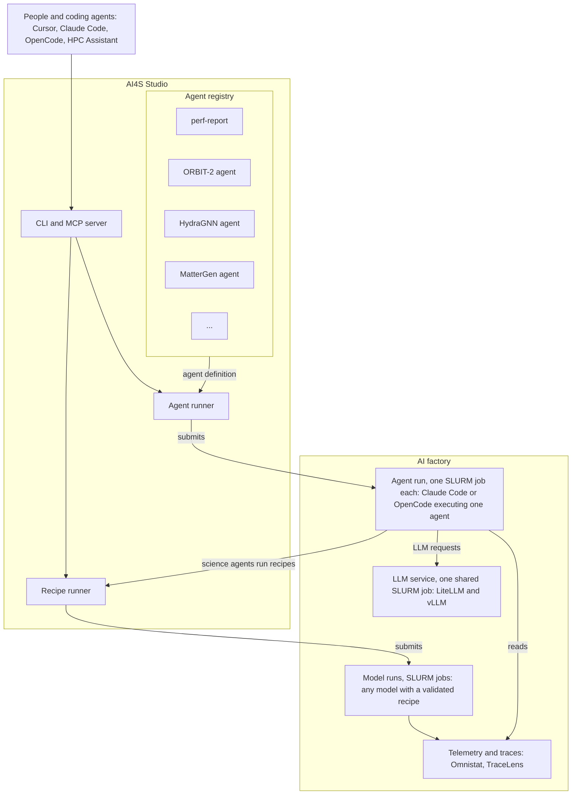

# Agents for Science in AI4Science Studio: design and roadmap

| Field | Value |
|---|---|
| Status | Draft v0.3, for team review |
| Target | One AI factory (single site) |
| Replaces | [`archive/agents-for-science-v0.2.md`](archive/agents-for-science-v0.2.md) |
| Last updated | 2026-10-02 |

## 1. Objective

Run AI4Science Studio (AI4S Studio) agents on an AI factory without a person at the terminal, using open LLMs served on the same AI factory.

The first product is an automatic performance report for an ORBIT-2 or HydraGNN training job. Each claim in the report cites telemetry or tool output.

Later phases add provenance export, model routing and declarative campaigns. Applications such as an AI Scientist or a cofolding agent can then launch whole campaigns through the same entry points.

## 2. Terms

| Term | Meaning |
|---|---|
| AI factory | An HPC cluster with AMD Instinct GPUs, SLURM, Apptainer and shared storage |
| Agent | A folder with `agent.yaml` (settings) and `playbook.md` (instructions), kept in the agent registry |
| Engine | The program that executes a playbook with an LLM: OpenCode or Claude Code |
| Agent runner | Starts an engine on one agent, as a SLURM job |
| Recipe runner | Submits an existing model recipe, waits, and checks its outputs; no LLM |
| Model alias | A name such as `ai4s/small` that LiteLLM maps to a served model |
| Recipe run | A deterministic submit, wait and check of an existing recipe; no LLM |
| Run | One execution of an agent or recipe, with its own run record |
| Run record | The run's folder: inputs, transcript, `result.json`, status |
| Campaign | A file listing agents and recipe runs, their order and human gates (Phase 3) |

## 3. Scope

**In scope:** one AI factory; SLURM and Apptainer; models with a validated recipe on that AI factory; OpenCode and Claude Code as engines.

**Out of scope:**
- agents that span several sites;
- Kubernetes;
- agent-to-agent messaging and A2A;
- an AI4S Studio-owned LLM loop, unless Phase 1 shows the engines cannot do the job;
- self-healing of running jobs;
- network isolation.

## 4. Functional requirements

| ID | Requirement | Phase |
|---|---|---|
| F1 | `ai4s agent list`, `show`, `new`, `validate` manage agents from the repo and from a user directory | 1 |
| F2 | `ai4s run <agent>` submits one SLURM job that starts the agent's engine non-interactively, inside Apptainer, against the LiteLLM endpoint | 1 |
| F3 | `ai4s recipe run <model>:<task>` submits a recipe, waits, checks its outputs and writes `result.json`, with no LLM | 1 |
| F4 | `--then <agent>` submits a follow-on run as a SLURM dependency job, so the report starts when the model run ends | 1 |
| F5 | Every run writes a run record: inputs, git commit, engine, model, commands and outputs, token counts, timings, `result.json`, status | 1 |
| F6 | An agent may only use the tools and commands in its `allow` list; SLURM actions are limited to the user's own jobs | 1 |
| F7 | One shared SLURM job serves gpt-oss-20b and gpt-oss-120b with vLLM, with a LiteLLM sidecar and the endpoint written to shared storage. `ai4s llm start`, `status`, `stop` manage it; it ends after an idle timeout; an agent run waits for it if it is not up | 1 |
| F8 | Each agent names one model alias; the site maps aliases to served models | 1 |
| F9 | The `perf-report` agent produces `perf_report.md` and `findings.json` for an ORBIT-2 or HydraGNN job; deterministic checks run first, and the LLM ranks and explains them | 1 |
| F10 | Each report is appended to a per-model index, so past runs can be compared | 1 |
| F11 | An eval runner grades the perf report against recorded benchmark runs, alongside the existing contract cases | 1 |
| F12 | The same functions are available as a stdio MCP server for Cursor, Claude Code, OpenCode and HPC Assistant | 1 |
| F13 | Run records export to Flowcept | 2 |
| F14 | `result.json` covers all models with a validated recipe; an application eval track uses the metrics those recipes compute | 2 |
| F15 | Model routing picks an alias per request; routing choices are evaluated with F11 | 2 |
| F16 | The optimizer agent ships, with a human approval before each job it launches | 2 |
| F17 | `ai4s campaign run`, `status`, `approve` execute a campaign file; steps pass values through `result.json` | 3 |
| F18 | An entry agent can write a campaign file and launch it through the MCP server | 3 |

## 5. Non-functional requirements

| ID | Requirement |
|---|---|
| N1 | On-prem models by default; hosted models only when the site enables them |
| N2 | No long-running service on the login node; LLM serving and agent runs are SLURM jobs |
| N3 | The run record is written by the agent runner or recipe runner, not by the LLM |
| N4 | `make check` validates agents and runs one report with a recorded LLM reply; no GPU needed |
| N5 | The engine can be replaced without changing the CLI, MCP tools, `agent.yaml` or the run record |

## 6. Architecture

The diagram shows Phase 1. Every box in the AI factory runs as a SLURM job inside an Apptainer container:

- **Agent run.** One job per run, usually CPU-only. The agent runner starts Claude Code or OpenCode on one agent from the registry, with the agent's playbook, allow list and model alias.
- **LLM service.** One job shared by all agent runs. vLLM batches their requests. The job ends after an idle timeout; the next agent run starts it again and waits for it.
- **Model runs.** The science workloads, for example ORBIT-2 or HydraGNN training. The recipe runner submits them, checks their outputs and writes `result.json`. No LLM is involved.

Both runners write a run record for every run (F5).

Flow for the first product:

1. `ai4s recipe run ORBIT-2:perf-analysis --then perf-report` submits the training job with Omnistat on.
2. When the job ends, SLURM starts the `perf-report` agent run.
3. The engine runs the deterministic checks on the job's telemetry and traces, uses the LLM to rank and explain the findings, and writes `perf_report.md` and `findings.json` into the run record.

Where later phases attach:

- Phase 2: a model router sits in front of LiteLLM; run records export to Flowcept.
- Phase 3: a campaign runner sits above the agent runner and the recipe runner, and calls both.

AI4S Studio ships as one Python package with three entry points: the CLI, the stdio MCP server, and the skills. The MCP server is started by the host for each session, so nothing runs on the login node between sessions. Installation is with `uv` from git, or as an Lmod module.

## 7. Agents shipped with AI4S Studio

| Agent | Purpose | Phase |
|---|---|---|
| `perf-report` | Post-job performance report, from the existing analyst, verifier and synthesizer playbooks | 1 |
| Science agents, one per model (for example ORBIT-2, HydraGNN, MatterGen) | Optional LLM wrapper around a recipe run, for choosing parameters or diagnosing a failure | 1 |
| `optimizer` | Proposes and runs the next configuration, from the existing perf-optimizer-loop recipes; human approval per job | 2 |
| `tempering` | Takes an existing runbook, playbook or recipe skill and hardens it for a target system in a tight loop | Later |

Provenance is recorded by the agent runner and recipe runner (N3), not by an agent.

## 8. Roadmap

### Phase 1: headless runs and the first report

| Item | Work |
|---|---|
| Headless runtime | CLI, agent runner, run record, allow lists, OpenCode and Claude Code engines, `--then` |
| On-prem LLMs | Shared vLLM serving job with LiteLLM sidecar; `ai4s llm start`, `status`, `stop`; idle timeout; endpoint file; two aliases |
| Recipe runs | `ai4s recipe run` and `result.json` for ORBIT-2 and HydraGNN |
| Performance report | `perf-report` agent; per-model report index |
| Evaluation | Three to five recorded benchmark runs; eval runner; existing contract cases |
| Entry points | CLI, stdio MCP server, skills |

Exit criteria:
- An ORBIT-2 and a HydraGNN training job each produce a report automatically, using an on-prem model.
- Every claim in each report cites telemetry or tool output.
- The report finds the known problem in each benchmark run, and raises no high-severity finding on the healthy runs.
- The same report can be started from the CLI and from an MCP host.

### Phase 2: provenance, coverage, routing

| Item | Work |
|---|---|
| Provenance | Flowcept export of run records |
| Coverage | `result.json` for every model with a validated recipe; application eval track |
| Model routing | Per-request alias choice, measured against the eval runner |
| Agents | `optimizer` with human approval |

Exit criteria:
- Run records appear in Flowcept.
- Routing beats the static aliases on the eval set at equal or lower cost.

### Phase 3: campaigns

| Item | Work |
|---|---|
| Campaign runner | Campaign files with steps, order, human gates, and values passed through `result.json` |
| Entry agents | Cursor, Claude Code or HPC Assistant writes a campaign file and launches it through MCP |
| Agent cards | Only once a consumer for them exists |

Exit criterion: a campaign of training, report, human review and optimization runs end to end.

### After Phase 3

Applications such as an AI Scientist, a cofolding agent or a co-scientist build their own agents, and launch campaigns through the CLI or MCP.

## 9. Open questions

1. Can a login node reach a compute node over HTTP? If not, interactive MCP sessions on the login node need another route to the endpoint.
2. Do OpenCode and Claude Code call tools reliably with gpt-oss through LiteLLM? This decides whether an AI4S Studio-owned loop is ever needed (N5).
3. What idle timeout should the shared LLM service use? The trade-off is GPUs held while idle against model load time on restart.
4. Where does the per-model report index live, and who can read it?
5. Which benchmark runs are recorded first, and who records them?
