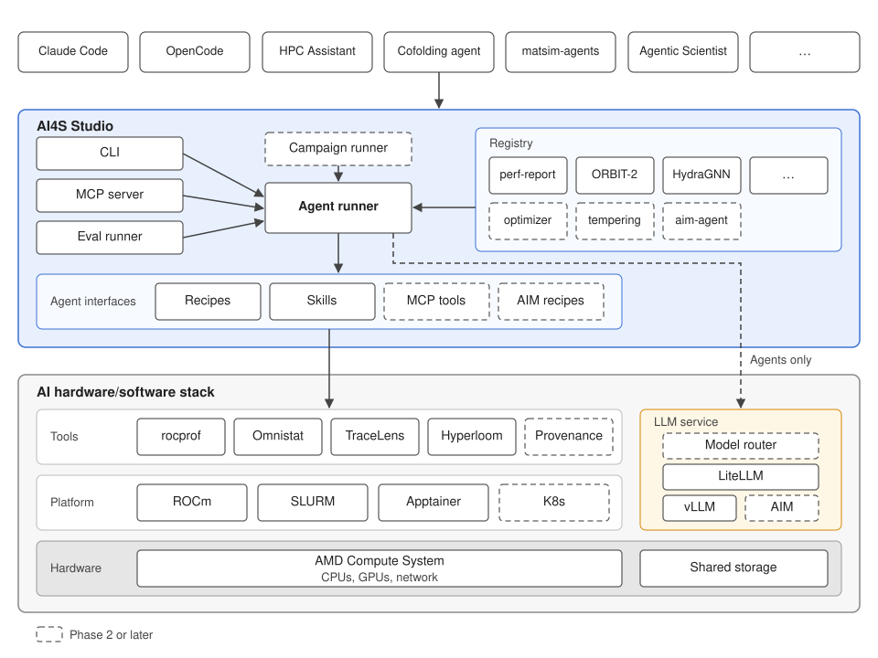

# Agents for Science in AI4Science Studio: design and roadmap

| Field | Value |
|---|---|
| Status | Draft v0.4, for team review |
| Target | One AI factory (single site) |
| Replaces | [`archive/agents-for-science-v0.2.md`](archive/agents-for-science-v0.2.md) |
| Last updated | 2026-10-05 |

## 1. Objective

Run AI4Science Studio (AI4S Studio) tasks and agents on an AI factory without a person at the terminal, using open LLMs served on the same AI factory.

The first product is an automatic performance report for an ORBIT-2 or HydraGNN training job. Each claim in the report cites telemetry or tool output.

Later phases add provenance export, model routing, human approval and declarative campaigns. Applications such as an AI Scientist, the cofolding agent or matsim-agents can then launch whole campaigns through the same entry points.

## 2. Terms

| Term | Meaning |
|---|---|
| AI factory | An HPC cluster with AMD Instinct GPUs, ROCm, SLURM, Apptainer and shared storage |
| Registry entry | A folder with `agent.yaml`; its `kind` is `task` or `agent` |
| Task | A registry entry that runs one recipe and checks its outputs; no LLM. Model tasks are named `<model>:<task>` |
| Agent | A registry entry that runs an engine with a playbook and an LLM |
| Recipe | A script in a model's `examples/` folder |
| Validated recipe | A recipe whose documented validation succeeds and whose expected outputs have been confirmed on the target AI factory |
| Engine | The program that executes a playbook with an LLM: OpenCode (default) or Claude Code |
| Agent runner | Runs one task or agent, as a SLURM job or as a step inside an existing allocation |
| LLM service | vLLM and LiteLLM; the one endpoint agents use |
| Model alias | A name such as `ai4s/small` that the LLM service maps to a served model |
| Run | One execution of a task or agent, with its own run record |
| Run record | The run's folder; see section 7 |
| Approval request | A pending agent action that needs a person's decision; see section 8 |
| Campaign | A file listing tasks and agents, their order and human gates (Phase 3) |

## 3. Scope

**In scope:** one AI factory; SLURM and Apptainer; models with a validated recipe on that AI factory; OpenCode as the default engine; Claude Code as an experimental engine with on-prem models.

**Out of scope:**
- agents that span several sites;
- Kubernetes;
- agent-to-agent messaging and A2A;
- an AI4S Studio-owned LLM loop, unless Phase 1 shows the engines cannot do the job;
- self-healing of running jobs;
- network isolation and sandboxing beyond the user's own permissions.

## 4. Functional requirements

| ID | Requirement | Phase |
|---|---|---|
| F1 | `ai4s agent list`, `show`, `new`, `validate` manage tasks and agents from the repo and from a user directory | 1a |
| F2 | `ai4s run <name>` runs one task or agent as a SLURM job, or as a step when called inside an existing allocation | 1a |
| F3 | A task submits its recipe and a check job that depends on it; the check job writes `result.json`. Inside an allocation, the recipe runs as a step. A task starts no engine and calls no LLM | 1a |
| F4 | An agent runs its engine non-interactively, inside Apptainer, as a CPU job or step, with its playbook, allow list and model alias | 1a |
| F5 | `--then <name>` runs a follow-on task or agent when the current run ends, as a SLURM dependency job or as the next step | 1a |
| F6 | Every run writes a run record, and every task writes `result.json`, in the formats of section 7; the runner validates both | 1a |
| F7 | An agent's allow list limits the tools and commands its engine may use; SLURM actions are limited to the user's own jobs | 1a |
| F8 | The `perf-report` agent produces `perf_report.md` and `findings.json` from recorded telemetry and traces. Deterministic checks run first; the LLM ranks and explains them. It submits and cancels no jobs | 1a: ORBIT-2; 1b: HydraGNN |
| F9 | An eval runner grades the perf report against recorded benchmark runs, alongside the existing contract cases | 1a |
| F10 | Report runs are immutable; a per-model report index is rebuilt from the run records | 1b |
| F11 | The LLM service runs vLLM with gpt-oss-20b and gpt-oss-120b from a pinned image and model revision, with LiteLLM as the endpoint, written to shared storage. `ai4s llm start`, `status`, `stop` manage it; the site maps aliases to served models | 1b |
| F12 | If the site enables a hosted provider and the agent or run opts in, the LLM service routes an alias to a hosted model when the on-prem model is unavailable. The run record names the model that served each request | 1b |
| F13 | A task exists for every model with a recipe validated on the target AI factory by the Phase 1b exit; coverage is checked with `ai4s agent validate` | 1b |
| F14 | The `assist` agent wraps any task, to choose its parameters or diagnose a failure | 1b |
| F15 | The same functions are available as a stdio MCP server for Cursor, Claude Code, OpenCode and HPC Assistant | 1b |
| F16 | Run records export to Flowcept | 2 |
| F17 | An application eval track uses the metrics in `result.json` | 2 |
| F18 | A model router in the LLM service picks an alias per request; routing choices are evaluated with F9 | 2 |
| F19 | Human approval, as in section 8 | 2 |
| F20 | The `optimizer` agent ships, with an approval for each job it submits | 2 |
| F21 | `ai4s campaign run`, `status`, `approve` execute a campaign file; steps pass values through `result.json` | 3 |
| F22 | An entry agent can write a campaign file and launch it through the MCP server | 3 |

## 5. Non-functional requirements

| ID | Requirement |
|---|---|
| N1 | On-prem models by default. Hosted models only when the site enables a provider and the agent or run opts in; never a silent fallback |
| N2 | No long-running service on the login node; the LLM service and all runs are SLURM jobs or steps |
| N3 | The run record is written by the agent runner, not by the LLM |
| N4 | A task needs no engine and no LLM endpoint |
| N5 | Every run executes as the submitting user, with that user's permissions. Allow lists are policy and audit, not a sandbox |
| N6 | Agent runs hold no GPUs. An agent waiting for approval holds no allocation |
| N7 | `make check` validates tasks, agents and the formats in section 7, and runs one report with a recorded LLM reply; no GPU needed |
| N8 | The CLI, `agent.yaml` and the run record stay the same when the engine changes. A new engine must pass the eval runner; its behaviour may still differ |

## 6. Architecture

The diagram shows Phase 1. Dashed boxes are Phase 2 or later.

- **Top row:** coding agents (Claude Code, OpenCode), HPC Assistant, and science agents such as the cofolding agent, matsim-agents and a co-scientist. Each uses AI4S Studio through the CLI or the MCP server.
- **AI4S Studio** holds the CLI, the MCP server, the agent runner, the registry and the agent interfaces.
- **Agent interfaces** are recipes, skills and, later, MCP tools. Tasks and agents use the tools and the platform only through them. AI4S Studio ships them; tool teams can contribute interfaces for their own tools.
- **AI hardware/software stack** is the AI factory: tools, platform software and hardware. AI4S Studio does not ship any of it.
- **LLM service:** vLLM runs on GPUs; LiteLLM is a CPU process next to it and is the only endpoint agents see. Tasks never use it.

How a run executes:

- **Task, outside an allocation.** The runner submits the recipe job and a check job with an `afterany` dependency on it. The check job verifies the outputs and writes `result.json`. No process waits.
- **Task, inside an allocation.** The recipe runs as an `srun` step, and the check runs after it. No nested `sbatch`.
- **Agent.** The runner starts the engine as a CPU job or step. An agent that needs a model run calls `ai4s run <task>`, which follows the rules above.
- **Follow-on.** `--then` becomes an `afterany` dependency, or the next step inside an allocation.

Flow for the first product:

1. `ai4s run ORBIT-2:perf-analysis --then perf-report` submits the training job with Omnistat on, and its check job.
2. When the check job ends, the `perf-report` agent runs.
3. Its engine runs the deterministic checks on the recorded telemetry and traces, uses the LLM to rank and explain the findings, and writes `perf_report.md` and `findings.json` into the run record.

Hosted models (F12). LiteLLM can list a hosted deployment, such as a frontier model, behind the same alias as the on-prem model. The hosted route is used only when all of the following hold:
- the site has enabled the provider;
- the agent sets `hosted: allowed`, or the run passes `--allow-hosted`;
- the on-prem model is not reachable, or the LLM service cannot start within a site-set wait.

The user's own API key is used. Otherwise the run waits or fails with a clear error. Reports state which model produced them. With a hosted Claude model, Claude Code becomes a supported engine.

Where later phases attach:

- Phase 2: the model router in the LLM service; Flowcept export; approval requests in the agent runner.
- Phase 3: a campaign runner above the agent runner.

AI4S Studio ships as one Python package with three interfaces: the CLI, the stdio MCP server, and the skills. The MCP server is started by the host for each session, so nothing runs on the login node between sessions. Installation is with `uv` from git, or as an Lmod module.

## 7. Formats

Each format carries `schema_version`. The agent runner validates `agent.yaml` before submitting and `result.json` when a run ends.

| Format | Fields |
|---|---|
| `agent.yaml`, all | `schema_version`, `name`, `kind` (`task` or `agent`), `version`, `description`, `inputs` (name, type, default), `outputs` |
| `agent.yaml`, task | `model`, `recipe` (script path), `checks` |
| `agent.yaml`, agent | `llm` (model alias), `engine`, `playbook`, `allow` (tools and commands), `hosted` (`allowed` or `forbidden`, default `forbidden`), `approval` (actions that need approval) |
| Run record (`run.json` plus files) | `run_id`, `parent_run_id`, `name`, `kind`, `version`, `state`, `user`, SLURM job and step IDs, start and end times, git commit and dirty-tree patch, container digest, model weight revisions, resolved inputs, nodes and GPUs, tool versions, engine and version, model used per request (on-prem or hosted), token counts with source (reported, estimated or unavailable), approvals; plus transcript, logs and `result.json` |
| `result.json` | `run_id`, `name`, `status` (`pass`, `fail` or `error`), `checks` (name, status, detail), `metrics` (name, value, unit), `artifacts` (path, SHA-256), `error` (type, message) |

Run states: `queued`, `running`, `awaiting_approval`, `succeeded`, `failed`, `cancelled`. A run record does not change after the run ends.

## 8. Human approval (Phase 2)

An agent action listed under `approval` in `agent.yaml` needs a person's decision. For the `optimizer`, that is every job it submits or cancels. A task that a user starts directly needs no approval, since the user started it.

| Aspect | Rule |
|---|---|
| Request | The runner stops the action and writes an approval request to the run record: the exact job script and parameters, their SHA-256, the estimated node-hours, and the agent's reason. The run moves to `awaiting_approval` |
| No idle allocation | The agent saves its state and its job ends. On approval, the runner submits the approved job and resumes the agent as a new run linked by `parent_run_id` |
| Who | The run owner by default; the site can name an approver group |
| How | `ai4s approve <request>` or `ai4s reject <request> --reason`, from the CLI or the MCP server. A rejection reason is passed to the agent when it resumes |
| Binding | An approval is valid only for that SHA-256. Any change to the script or parameters needs a new request |
| Expiry | A request expires after a site-set time, 24 hours by default, and counts as rejected |
| Standing approval | Optional, per run or campaign: maximum jobs, maximum node-hours per job and in total, allowed parameter ranges, and an end date. Actions inside the limits are approved automatically and recorded |
| Notification | `ai4s status` and the MCP server list pending requests; the site can add an email or chat hook |
| Audit | Approver, time, SHA-256 and decision are written to the run record |

Campaign human gates in Phase 3 use the same mechanism.

## 9. Tasks and agents shipped with AI4S Studio

| Name | Kind | Purpose | Phase |
|---|---|---|---|
| Model tasks (for example `ORBIT-2:train`, `HydraGNN:train`, `MatterGen:generate`) | Task | Run one recipe and write `result.json`; one for every model with a recipe validated on the target AI factory | 1a: ORBIT-2; 1b: the rest |
| `perf-report` | Agent | Read-only post-job performance report, from the existing analyst, verifier and synthesizer playbooks with their job-submitting probes removed | 1a: ORBIT-2; 1b: HydraGNN |
| `assist` | Agent | Wraps any task, to choose its parameters or diagnose a failure | 1b |
| `optimizer` | Agent | Proposes and runs the next configuration, from the existing perf-optimizer-loop recipes; approval per job | 2 |
| `tempering` | Agent | Takes an existing runbook, playbook or recipe skill and hardens it for a target system in a tight loop | Later |

Provenance is recorded by the agent runner (N3), not by an agent.

## 10. Roadmap

### Phase 1a: one working slice

| Item | Work |
|---|---|
| Runtime | CLI, agent runner (job or step), tasks, run record and formats, allow lists, OpenCode engine, `--then` |
| LLM | An LLM endpoint that the site already runs, set in site configuration |
| Tasks | ORBIT-2 tasks with checks and `result.json` |
| Report | Read-only `perf-report` for ORBIT-2 |
| Evaluation | Recorded ORBIT-2 benchmark runs; eval runner; existing contract cases |

Exit criteria:
- An ORBIT-2 training job produces a report automatically, using an on-prem model.
- Every claim in the report cites telemetry or tool output.
- The report finds the known problem in each benchmark run, and raises no high-severity finding on the healthy runs.
- A task runs with no LLM endpoint configured.
- `make check` validates the formats in section 7.

### Phase 1b: coverage and serving

| Item | Work |
|---|---|
| LLM service | `ai4s llm start`, `status`, `stop`; pinned vLLM image and model revision; aliases; opt-in hosted routing |
| Tasks | HydraGNN, and every model with a recipe validated on the target AI factory, with per-model checks. Some recipes print outputs without checking them today, so their checks must be written |
| Report | HydraGNN support; report index rebuilt from run records |
| Engines | Claude Code: experimental with gpt-oss, supported with a hosted Claude model |
| Agents | `assist` |
| Interfaces | stdio MCP server; skills |

Exit criteria:
- A HydraGNN training job produces a report automatically.
- The same report can be started from the CLI and from an MCP host.
- Every model with a recipe validated on the target AI factory has a task that passes `ai4s agent validate`.
- Hosted routing is used only when opted in, and the run record shows it.

### Phase 2: provenance, routing, approval

| Item | Work |
|---|---|
| Provenance | Flowcept export of run records |
| Evaluation | Application eval track from the metrics in `result.json` |
| Model routing | Model router in the LLM service, measured against the eval runner |
| Approval | Section 8 |
| Agents | `optimizer` |

Exit criteria:
- Run records appear in Flowcept.
- Routing beats the static aliases on the eval set at equal or lower cost.
- An `optimizer` session runs several iterations; every job it submits is approved and matches its approved SHA-256.

### Phase 3: campaigns

| Item | Work |
|---|---|
| Campaign runner | Campaign files with steps, order, human gates, and values passed through `result.json` |
| Entry agents | Cursor, Claude Code or HPC Assistant writes a campaign file and launches it through MCP |
| Agent cards | Only once a consumer for them exists |

Exit criterion: a campaign of training, report, human review and optimization runs end to end.

### After Phase 3

Applications such as an AI Scientist, the cofolding agent, matsim-agents or a co-scientist build their own tasks and agents, and launch campaigns through the CLI or MCP.

## 11. Open questions

1. LLM serving placement. The Phase 1b default is one shared serving job with an idle timeout. Open: the timeout value, and whether a serving step inside a campaign's allocation is also needed.
2. Can a login node reach a compute node over HTTP? Headless runs only need compute nodes to reach the LLM service; this matters for interactive MCP sessions on the login node.
3. Does OpenCode call tools reliably with gpt-oss through LiteLLM? This decides whether an AI4S Studio-owned loop is ever needed (N8).
4. Where does the per-model report index live, and who can read it?
5. Which benchmark runs are recorded first, and who records them?
