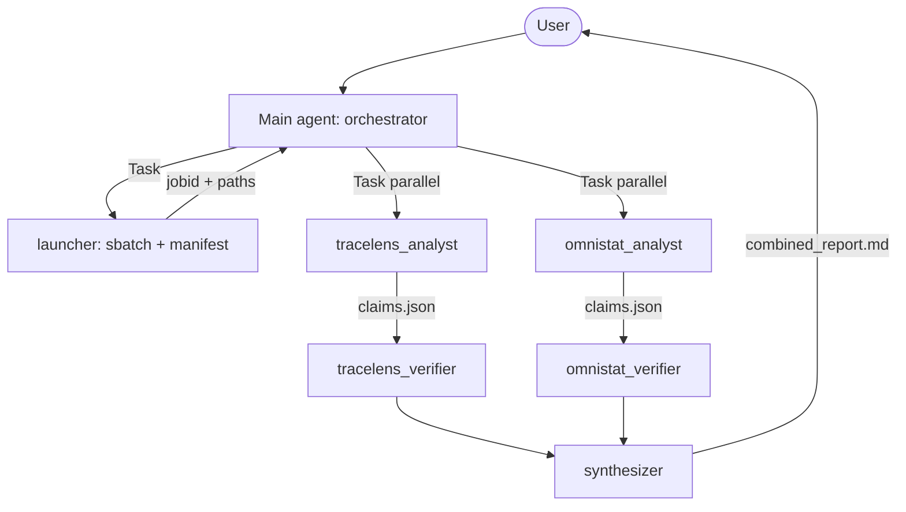

# HydraGNN Performance Analysis with AMD AI Agents

Multi-subagent workflow that launches a 2-node HydraGNN training on AMD Instinct MI355X (gfx950), captures PyTorch traces and Omnistat telemetry, then runs paired analytics + verifier subagents to identify bottlenecks and propose remedies.

> **Audience:** performance engineers. The output is a diagnosis of the run, not a scientific claim about HydraGNN.

## OmniHub alternative (standardized results)

For token-efficient agent parsing via `processed-data/`, use recipe `perf-analysis-omnihub` in `model.yaml` and `.cursor/skills/ai4science-omnihub/SKILL.md`:

```bash
./integrations/omnihub/generate-job.sh --perf --num-nodes 2 --output job.slurm
sbatch -A vultr_lux job.slurm
# then omnihub-process + omnihub-index
```

This uses `/shared/omnihub/tools/omnistat` and OmniHub's `tracelens` tool. The legacy path below (`sbatch_train_perf_amd.sh` + the `omnihub-inspect` venv at `/shared/omnihub/tools/omnihub-inspect` + subagent claims) remains for deep `omnistat-inspect` / PromQL workflows.

## What this recipe does

1. **Launcher** subagent submits a 2-node training (`sbatch_train_perf_amd.sh`) with PyTorch profiling armed for one target epoch and Omnistat user-mode collecting on every node.
2. **Analytics** subagents (TraceLens + Omnistat) run after the job, in parallel, and each emits a `claims.json`.
3. **Verifier** subagents independently re-derive the top claims from raw data and optionally probe cheap remedies on a 1-node interactive `srun`.
4. **Synthesizer** merges, ranks, and writes `combined_report.md`.



## Quick start

```bash
# 1. From the ai4science-studio repo root, ensure the cluster config is present
ls .cluster-config.yaml

# 2. Set the shared dir and submit the perf-analysis job
export AI4S_SHARED_DIR=/shared/$USER
sbatch material_science/models/HydraGNN/examples/sbatch_train_perf_amd.sh

# 3. Once the job completes, drive the analyst + verifier + synthesizer subagents
#    via the Cursor agent (or Claude Code). The agent reads
#    .cursor/skills/ai4science-perf-analysis/SKILL.md to dispatch them.
```

The orchestrating agent is expected to run on a **login node** with shell + filesystem access to `$AI4S_SHARED_DIR`. Verifier subagents that need a compute node use short interactive `srun -p <partition> -A <account> -N1 --time=00:05:00` allocations; they never grab 2-node allocations.

## Artifacts

After a complete run:

```
$AI4S_SHARED_DIR/models/HydraGNN/perf-runs/<jobid>/
├── manifest.json                      # written by launcher
├── omnistat-db/                       # VictoriaMetrics datadir
├── logs/<model_name>/*.pt.trace.json  # PyTorch trace (rank 0 only)
├── hydragnn-train-<jobid>.out         # SLURM stdout
├── tracelens/
│   ├── report.xlsx                    # TraceLens output
│   ├── claims.json                    # tracelens_analyst output
│   └── verified_claims.json           # tracelens_verifier output
├── omnistat/
│   ├── inspect_outputs/*.json         # omnistat-inspect raw outputs
│   ├── claims.json                    # omnistat_analyst output
│   └── verified_claims.json           # omnistat_verifier output
└── combined_report.md                 # synthesizer output
```

The `combined_report.md` is the deliverable: ranked bottlenecks, remedies tried with deltas, remedies proposed but not tried, and clearly-flagged "system limit reached" cases.

## Prerequisites

- Cluster access with the standard HydraGNN setup at `$AI4S_SHARED_DIR/models/HydraGNN/` — overlay, weights, code clone. See [HydraGNN/recipes/train/](../train/).
- Export `PERF_TOOLS_DIR` (the shared perf-tool location, from `.cluster-config.yaml` `perf_tools.dir`, e.g. `/path/to/perf-tools`). Scripts and subagents resolve all tool paths from this var — no cluster path is hardcoded.
- One-time install of Omnistat (PR #271 branch `jorda/skills`, with `origin/main` merged in), VictoriaMetrics, and TraceLens — performed lazily by the launcher subagent into `${PERF_TOOLS_DIR}/`.
- The launcher writes `gfm_mlip_with_profile.json` at submit time (does not modify the upstream `gfm_mlip.json`).

## Telemetry knobs (set at `sbatch` submit time)

| Env var | Default | What it does |
|---|---|---|
| `OMNISTAT_KERNEL_TRACE` | `0` | When `1`, loads `libomnistat_trace.so` via `ROCP_TOOL_LIBRARIES` on every rank and turns on the omnistat kernel-trace collector. Adds per-kernel dispatch count + duration time series across all 8 cards on every node. Requires the library to be built once (see `agents/launcher.md` step 1e). Validated end-to-end on job 7034. |
| `OMNISTAT_TRACE_LIB` | `${PERF_TOOLS_DIR}/omnistat-src/build-trace/libomnistat_trace.so` | Override only for development. The wrapper hard-fails if the path is missing when `OMNISTAT_KERNEL_TRACE=1`. |
| `OMNISTAT_TRACE_LOG` | `1` | Library prints `[host][pid][omnistat] Trace summary: N/N processed records (M/M successful flushes)` on rank exit; useful as a smoke-signal that the tool initialized even when the workload crashed. |

`enable_rocprofiler=True` is **on** in `omnistat.config.template` by default; the rendered config's state is printed in the sbatch banner so a silent "counters off" cannot recur. Kernel tracing and device-counting can co-exist on a single GPU but raise per-job VictoriaMetrics cardinality — pick by run length and the question you're asking. See `ai4science-studio` SKILL §12 for the device-counting vs kernel-trace vs `rocprofv3` decision matrix.

## Bottleneck taxonomy (used by analysts and verifier)

Each claim must map to one of:

| class | examples |
|---|---|
| `gpu_compute` | matmul/MFMA bound; low MFU; low TFLOPS vs roofline |
| `gpu_memory_hbm` | HBM bandwidth-bound; high `FETCH_SIZE`+`WRITE_SIZE` |
| `cpu_dispatch` | Python overhead between kernels; aten dispatch dominating; "GPU starvation" |
| `comm_xgmi` | intra-node allreduce / scatter-gather over XGMI |
| `comm_scaleout` | inter-node RCCL over ionic; ANP plugin throughput |
| `dataloader` | torch DataLoader; ADIOS2 read time; preprocessing |
| `host_io` | `/shared` NFS reads, MIOpen cache misses |
| `host_cpu` | OMP_NUM_THREADS, CPU saturation, NUMA effects |

## Agent prompt files

Per-subagent prompts (each ≤200 lines, self-contained):

- [agents/launcher.md](agents/launcher.md)
- [agents/tracelens_analyst.md](agents/tracelens_analyst.md)
- [agents/tracelens_verifier.md](agents/tracelens_verifier.md)
- [agents/omnistat_analyst.md](agents/omnistat_analyst.md)
- [agents/omnistat_verifier.md](agents/omnistat_verifier.md)
- [agents/synthesizer.md](agents/synthesizer.md)

The orchestrating agent dispatches each as a Task subagent (or shell script in iteration 2 with LangGraph). Each subagent's output JSON is the typed state for the next.

## Out of scope (iteration 1)

- LangGraph or any async backplane — subagents communicate via JSON files only.
- Multi-rank trace fusion (`TraceLens_generate_multi_rank_collective_report_pytorch`) — single-rank trace for now.
- A/B comparative runs — recommended in `combined_report.md` but not auto-launched.
- Editing upstream HydraGNN — everything driven via JSON config + env vars.

## Safety / etiquette

- Verifier remedy probes use **1-node** interactive allocations only, ≤5 min each.
- Never re-runs the full 2-node job during analysis — that's a deliberate choice for the agent.
- All artifacts under `$AI4S_SHARED_DIR/...`; large traces and DBs are not committed (see repo `.gitignore`).
- Research/perf-engineering only — no scientific claims about HydraGNN should be derived from these short runs.
