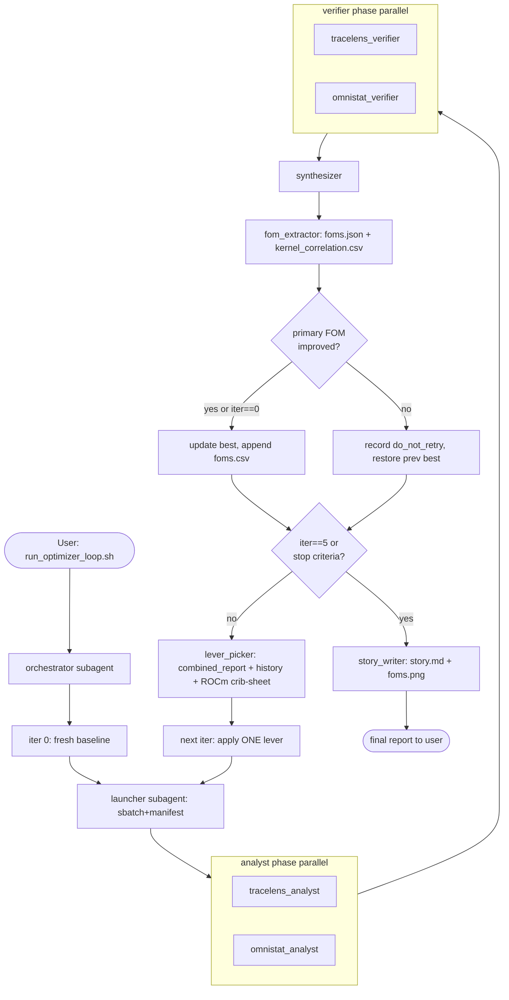

# HydraGNN Iterative Systems Optimizer Loop

Multi-iteration optimizer that runs HydraGNN on 2 nodes × 8 × MI355X (gfx950), picks one performance lever per iteration, runs the existing analyst/verifier/synth pipeline from [`recipes/perf-analysis/`](../perf-analysis/), records six FOMs, accepts or auto-reverts based on the primary FOM, and writes a progression story across 3-5 iterations.

> Audience: AMD performance engineering. Output is a diagnosis + tunings, not a HydraGNN scientific claim.

> **Picking up this work?** Start with [`dispatch-attribution.md`](dispatch-attribution.md) (current-best attribution, ~75 s/epoch) and [`lever_catalog.yaml`](lever_catalog.yaml) (every lever tried, accepted/blocked with evidence). Cross-cutting lessons live in [`.cursor/skills/ai4science-perf-analysis/SKILL.md`](../../../../.cursor/skills/ai4science-perf-analysis/SKILL.md).

## What this recipe adds on top of `perf-analysis/`

| Concern | `perf-analysis/` | `perf-optimizer-loop/` |
|---|---|---|
| Number of runs | one | 3-5, with auto accept/revert |
| Lever selection | manual (user reads `combined_report.md`) | LLM-driven via `lever_picker` over `lever_catalog.yaml` |
| FOM tracking | per-run claims | per-iter `foms.csv` + progression chart |
| Output | one `combined_report.md` | per-iter reports + final `story.md` + `foms.png` |
| Async | foreground only | tmux + Claude Code CLI driver for overnight runs |
| Attribution | TraceLens xlsx + Omnistat JSON | adds 1-s window TraceLens↔Omnistat correlation |

## Orchestration loop



## Quick start (overnight unattended via Claude Code CLI in tmux)

```bash
ssh <login-node>
export ANTHROPIC_API_KEY=...                    # user sets manually; never committed
export AI4S_SHARED_DIR=<your-shared-storage-root>
cd <repo-root>
tmux new -s hg-loop
bash material_science/models/HydraGNN/examples/run_optimizer_loop.sh $(uuidgen) 5
# Ctrl-b d to detach. tmux session lives until login-node reboot.
```

Morning workflow:

```bash
cat $AI4S_SHARED_DIR/models/HydraGNN/perf-runs/loop-<uuid>/STATUS.txt | tail -50
cat $AI4S_SHARED_DIR/models/HydraGNN/perf-runs/loop-<uuid>/story.md
```

## Artifact layout (per-loop)

```
$AI4S_SHARED_DIR/models/HydraGNN/perf-runs/
├── loop-<uuid>.json                  # registers loop id, baseline jobid, best jobid
├── loop-<uuid>/
│   ├── STATUS.txt                    # append-only event log (driver writes after every step)
│   ├── STOP                          # touch this file to gracefully stop the loop
│   ├── do_not_retry.json             # levers that regressed primary FOM
│   ├── foms.csv                      # one row per iteration
│   ├── foms.png                      # FOM progression line chart
│   ├── story.md                      # final progression narrative
│   ├── iter-0-baseline.json          # symlink → ../<jobid>/manifest.json
│   ├── iter-1-batch_800.json         # symlink → ../<jobid>/manifest.json
│   └── ...
└── <jobid>/                          # per-iter dir, written by existing perf-analysis launcher
    ├── manifest.json
    ├── logs/*.pt.trace.json
    ├── omnistat-db/
    ├── tracelens/{report.xlsx,csvs/,verified_claims.json}
    ├── omnistat/{inspect_outputs/,verified_claims.json}
    ├── kernel_correlation.csv        # NEW: TraceLens↔Omnistat 1-s window join
    ├── foms.json                     # NEW: this iter's six FOMs
    └── combined_report.md            # synthesizer output
```

## Iteration shape

Each iteration submits the existing [`sbatch_train_perf_amd.sh`](../../examples/sbatch_train_perf_amd.sh) with overrides:

| Knob | Loop default | Why |
|---|---|---|
| `HG_NUM_EPOCH` | 3 | Steady-state past warm-up; epoch-0 timing dropped |
| `HYDRAGNN_MAX_NUM_BATCH` | 50 | 6-8 min wall; fits in `--time=00:30:00` |
| `PROFILE_TARGET_EPOCH` | 2 | Sidesteps the worker-respawn ProfilerStep#8 artifact from R2 |
| `HG_BATCH_SIZE` | 400 (baseline) | R2 best; loop may move to 800 in iter-1 |

## Figures of Merit

Per `agents/fom_extractor.md`:

| FOM | Source | Role |
|---|---|---|
| `epoch_time_s` | `parse_convergence.py` over `hydragnn-train-<jobid>.out`, mean over `epoch >= 1` | **PRIMARY** (accept/revert) |
| `throughput_samples_per_s` | `max_num_batch * batch_size * ranks / epoch_time` | report |
| `mfma_tflops` | PromQL: `rate(SQ_INSTS_VALU_MFMA_MOPS_F64) * join(rmsjob_info{jobid})` | report |
| `energy_J` | integral of `rocm_avg_pwr` over runtime, summed across 16 cards | report |
| `mean_power_W` | `energy_J / runtime` | report |
| `energy_per_sample_J` | `energy_J / total_samples_processed` | report |
| `final_loss` | last `train_loss` from `convergence.csv` | **CONTROL** (auto-reject if > 1.5× baseline) |

## Levers in the catalog (ranked by expected payoff at R2 state)

See [`lever_catalog.yaml`](lever_catalog.yaml) for the full machine-readable list. High-level ranking and provenance:

| # | Lever id | Type | Expected payoff | Citation |
|---|---|---|---|---|
| 1 | `batch_800` | env-only | `HG_BATCH_SIZE` 400→800; R2 #1 next-lever | R2 `combined_report.md` |
| 2 | `torch_compile_e3nn` | rank-script patch | `torch.compile(model, fullgraph=False, mode='max-autotune')`; R2 #2 next-lever | [MI300X workload §torch.compile](https://rocm.docs.amd.com/en/latest/how-to/tuning-guides/mi300x/workload.html) |
| 3 | `rccl_high_priority` | env-only | `TORCH_NCCL_HIGH_PRIORITY=1`, `GPU_MAX_HW_QUEUES=2` | [MI300X workload §RCCL](https://rocm.docs.amd.com/en/latest/how-to/tuning-guides/mi300x/workload.html) |
| 4 | `tunable_op` | env-only | `PYTORCH_TUNABLEOP_ENABLED=1`, `PYTORCH_TUNABLEOP_TUNING=1` | [MI300X workload §TunableOp](https://rocm.docs.amd.com/en/latest/how-to/tuning-guides/mi300x/workload.html) |
| 5 | `num_workers_sweep` | env-only | `HYDRAGNN_NUM_WORKERS=12`, persistent_workers=1 | local lesson (R1, R2 reports) |
| 6 | `nccl_minchannels` | env-only | `NCCL_MIN_NCHANNELS=112` | [Multi-node ROCm AI setup](https://rocm.docs.amd.com/en/docs-7.0.1/how-to/rocm-for-ai/system-setup/multi-node-setup.html) |
| 7 | `precision_fp32` | env-only | `HG_PRECISION=fp32`; gfx950 fp32 MFMA peak ~2× fp64 | gfx950 spec; HydraGNN/MACE fp32 floor (bf16 breaks equivariance) |
| 8 | `kernel_trace_diag_only` | env-only, diagnostic | `OMNISTAT_KERNEL_TRACE=1`; only when 1-s TL↔OS correlation can't attribute the dominant kernel | [SKILL §12](../../../../../.cursor/skills/ai4science-studio/SKILL.md) |

`bf16` is **deliberately excluded** — the model is fp32-floor for MACE-style equivariant features.

## Loop control

- **Cap:** 5 iterations.
- **Stop early:** when (a) `lever_picker` reports the catalog is exhausted (every entry tried or in `do_not_retry.json`), OR (b) the last 2 accepted iterations each improved primary FOM by < 5%.
- **Auto-revert:** an iteration that regresses `epoch_time_s` (vs current best) by any amount, OR raises `final_loss` by > 50% vs baseline, is rejected. The lever id lands in `do_not_retry.json`; the next iteration restores the previous-best config.
- **Diagnostic iterations** (`diagnostic_only=true` in the catalog) do NOT count toward the auto-revert logic, but DO count against the 5-iter budget.
- **Single variable per iteration** — the orchestrator must change exactly one lever, otherwise FOM deltas cannot be attributed.

## Abort controls

- **Graceful:** `touch $AI4S_SHARED_DIR/models/HydraGNN/perf-runs/loop-<uuid>/STOP`. Driver checks the flag (a) before every `sbatch`, (b) before every analyst phase, (c) before every iteration decision. Active SLURM jobs run to completion and get analyzed; no further iterations launch.
- **Emergency:** `scancel <jobid>` for the active job + `tmux kill-session -t hg-loop` (or `kill -INT <driver_pid>`). The driver traps SIGINT and writes `LOOP_ABORT reason=signal` to STATUS.txt before exiting.

## Disk budget

- Per iteration footprint: ~135 MB (matches R2 shape: kineto trace 110-125 MB + TraceLens 8 MB + omnistat-db 1-3 MB + omnistat inspect ~200 KB).
- 5-iter loop projected: ~0.7 GB. Check `df -h $AI4S_SHARED_DIR` before starting.
- No per-loop quota enforced; orchestrator logs `du -sh loop-<uuid>/` after each iter to STATUS.txt for visibility.
- `OMNISTAT_KERNEL_TRACE=1` raises VictoriaMetrics cardinality ~1000× (per [SKILL §12](../../../../../.cursor/skills/ai4science-studio/SKILL.md)). The `kernel_trace_diag_only` lever is gated `diagnostic_only=true` and only fires when the 1-s correlation falls short — at most 1 of 5 iterations.

## Agent prompt files

- [`agents/orchestrator.md`](agents/orchestrator.md) — main loop, dispatches all other subagents, accept/revert/STATUS.txt/STOP-flag.
- [`agents/lever_picker.md`](agents/lever_picker.md) — proposes the next single lever as JSON, biased by `lever_catalog.yaml` + previous reports + ROCm crib-sheet.
- [`agents/fom_extractor.md`](agents/fom_extractor.md) — computes 6 FOMs + writes `kernel_correlation.csv` from TraceLens trace + Omnistat PromQL.
- [`agents/story_writer.md`](agents/story_writer.md) — final progression narrative + matplotlib `foms.png`.

Plus the existing prompts inherited from [`recipes/perf-analysis/agents/`](../perf-analysis/agents/): `launcher.md`, `tracelens_analyst.md`, `tracelens_verifier.md`, `omnistat_analyst.md`, `omnistat_verifier.md`, `synthesizer.md`.

## References (ROCm blogs and docs cited in the lever catalog)

- [Optimizing LLM Workloads: AMD Instinct MI355X GPUs Drive Competitive Performance — ROCm Blogs (ROCm 7.0)](https://rocm.blogs.amd.com/artificial-intelligence/ROCm7-MI355X-training-performance/README.html)
- [AMD Instinct MI300X workload optimization — ROCm Documentation](https://rocm.docs.amd.com/en/latest/how-to/tuning-guides/mi300x/workload.html)
- [QuickReduce FP4 Quantization and Benchmarking on MI355 — ROCm Blogs](https://rocm.blogs.amd.com/artificial-intelligence/quick-reduce-2/README.html)
- [Accelerating ComfyUI Workflows on AMD Instinct MI355X GPUs with ROCm — ROCm Blogs](https://rocm.blogs.amd.com/artificial-intelligence/comfyui/README.html)
- [Multi-node setup for AI workloads — ROCm Documentation](https://rocm.docs.amd.com/en/docs-7.0.1/how-to/rocm-for-ai/system-setup/multi-node-setup.html)
- [Training a model with PyTorch on ROCm — ROCm Documentation](https://rocm.docs.amd.com/en/develop/how-to/rocm-for-ai/training/benchmark-docker/previous-versions/pytorch-training-v25.9.html)

## Out of scope

- Cross-model levers (HydraGNN only here).
- Multi-variable lever combinations in one iteration (breaks delta attribution; do as separate study after this loop converges).
- Auto-rebuild of HydraGNN overlay; only env-var and rank-script-monkey-patch changes allowed.
- Editing upstream HydraGNN source; use the rank-script monkey-patch pattern already in [`sbatch_train_perf_amd.sh`](../../examples/sbatch_train_perf_amd.sh).
- A scientific claim about HydraGNN convergence — short runs, loss is a control, not a headline.
